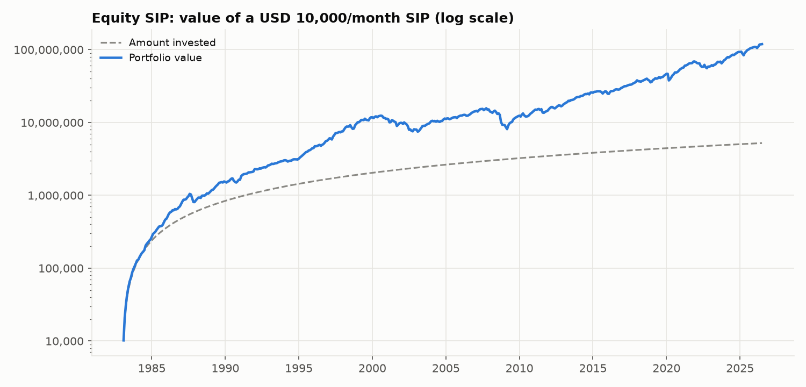
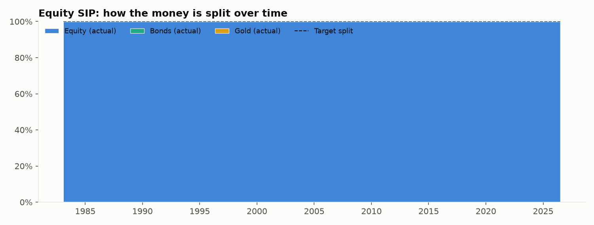
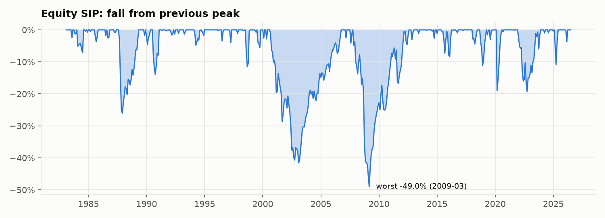

# Strategy 1: Equity SIP (100% stocks)

> **Idea:** Put the whole instalment into stocks every month. This is what most people's SIP is, so it's the **main benchmark**.

## The rule

1. Every month, invest the full 10,000 in **equity** (S&P 500, dividends reinvested).
2. Never sell, never rebalance.

## The formula

Target weights (every month):

    w = (Equity 100%, Bonds 0%, Gold 0%)

Money bought each month:  Equity = 10,000.

## Worked example: your first month (Feb 1983)

Returns that month: Equity +2.13%, Bonds −0.69%, Gold +2.08% (see `00_raw_data/`).

| | Equity | Bonds | Gold | Total |
|---|---|---|---|---|
| Invest | 10,000 | 0 | 0 | 10,000 |
| After 0.1% cost | 9,990 | 0 | 0 | 9,990 |
| × Feb 1983 return (+2.13%) | 10,203 | 0 | 0 | **10,203** |

## How it behaves over time

The allocation chart is a single block: 100% equity for 43 years. All the risk comes from one asset, which is why the account swings so much.

## Results

**Setup (identical for all six strategies):** 10,000 invested on the 1st of every month
from **Feb 1983 to Jul 2026** (522 instalments, **5,220,000 invested**), 0.1% cost on
every trade, USD data (rupee version below).

| Measure | Value | What it means |
|---|---|---|
| Final value | **119,106,074** | What the 5,220,000 grew into (22.8×) |
| XIRR | **11.3%** | Yearly return earned on your SIP money |
| Volatility | 12.3% | How bumpy the ride was (yearly) |
| Sharpe ratio | **0.99** | Return per unit of bumpiness (higher = better) |
| Worst fall in account | **-48.3%** | Biggest drop from a peak you would have seen |
| Max drawdown (returns) | -49.0% | Same idea, ignoring new instalments |
| Selling per year | 0.0% | Share of the portfolio sold yearly (tax proxy) |

**Every possible 10-year SIP** (403 start dates, Feb 1983 onwards):

| Median XIRR | Worst XIRR | Best XIRR | % that lost money | Typical worst fall | Worst fall (any) |
|---|---|---|---|---|---|
| 11.8% | -7.2% | 21.5% | 3.0% | -18.5% | -41.2% |

**Through market crashes** (return of the portfolio during each period):

| Period | Return |
|---|---|
| 1987 crash (Sep-Nov 1987) | -25.0% |
| Dot-com bust (Sep 2000-Sep 2002) | -39.9% |
| Global financial crisis (Nov 2007-Feb 2009) | -46.0% |
| COVID crash (Feb-Mar 2020) | -18.8% |
| 2022 rate shock (Jan-Sep 2022) | -16.7% |

**Rupee investor (same assets, returns converted to INR):** final value
698,895,984, XIRR **16.9%**, Sharpe 1.36, worst fall
-38.4%, 2.5% of 10-year SIPs lost money.

### Charts







## Strengths and weaknesses

**Strengths**
- **Highest return** of all six (11.3% a year): stocks were the best-performing asset over 1983–2026.
- Simplest possible rule; no selling, so no tax events or rebalancing costs.

**Weaknesses**
- **Biggest falls**: the account dropped **48%** at its worst (2008–09) and lost 7.1 M between Oct 2007 and Feb 2009, even while new instalments went in.
- **Most uncertain outcome**: 10-year results ranged from −7.2% to +21.5% a year, and 3% of 10-year SIPs ended with less money than was put in.

## Files in this folder

| File | What it is |
|---|---|
| `strategy.py` | **The rule, in code.** Run it to regenerate everything below |
| `results/usd/summary.md` | All results in one page (also `summary.csv`) |
| `results/usd/monthly.csv` | Month-by-month: instalment, value of each asset, target and actual split, amount bought/sold, costs |
| `results/usd/rolling_10y_windows.csv` | XIRR and worst fall of each of the 403 ten-year SIPs |
| `results/usd/crises.csv` | Return in each crash period |
| `results/usd/*.png` | The three charts above |
| `results/inr/` | The same files for a rupee investor |

## How to run

```bash
python 01_equity_sip/strategy.py
```

It reads the prepared returns table from `00_raw_data/`, runs the SIP month by month
using the shared engine in `sip/` (the same for all six strategies) and rewrites
`results/`.
