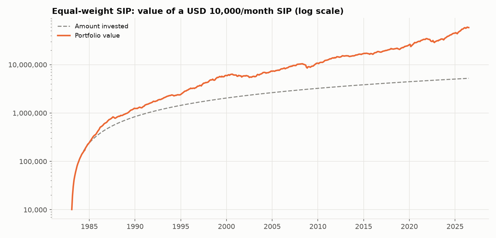
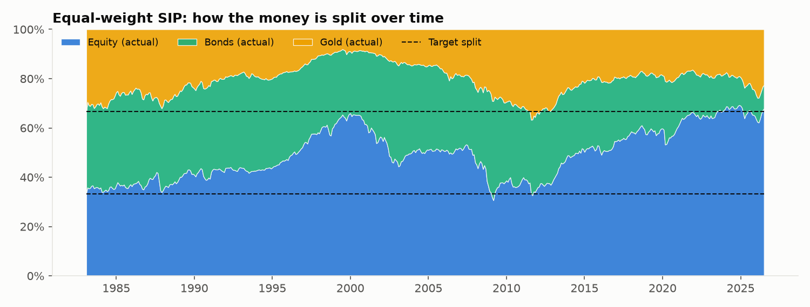
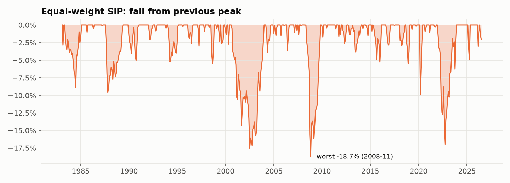

# Strategy 2: Equal-weight SIP (⅓ each)

> **Idea:** Split every instalment equally between stocks, bonds and gold and never touch it. The simplest possible diversified SIP.

## The rule

1. Every month, invest **3,333 in each** of equity, bonds and gold.
2. Never sell, never rebalance.

## The formula

Target weights (every month):

    w = (Equity 1/3, Bonds 1/3, Gold 1/3)

Money bought each month:  3,333 in each asset.

## Worked example: your first month (Feb 1983)

Returns that month: Equity +2.13%, Bonds −0.69%, Gold +2.08% (see `00_raw_data/`).

| | Equity | Bonds | Gold | Total |
|---|---|---|---|---|
| Invest | 3,333 | 3,333 | 3,333 | 10,000 |
| After 0.1% cost | 3,330 | 3,330 | 3,330 | 9,990 |
| × Feb 1983 return | +2.13% → 3,401 | −0.69% → 3,307 | +2.08% → 3,399 | **10,107** |

## How it behaves over time

**Watch the allocation chart:** new money always goes in ⅓ each, but nothing is ever
sold, so the portfolio **drifts** toward whatever grew fastest. By 2026 it is about
**68% equity, 10% bonds, 22% gold**, far from ⅓ each. In practice this SIP slowly
becomes a stock-heavy portfolio.

## Results

**Setup (identical for all six strategies):** 10,000 invested on the 1st of every month
from **Feb 1983 to Jul 2026** (522 instalments, **5,220,000 invested**), 0.1% cost on
every trade, USD data (rupee version below).

| Measure | Value | What it means |
|---|---|---|
| Final value | **58,470,676** | What the 5,220,000 grew into (11.2×) |
| XIRR | **9.0%** | Yearly return earned on your SIP money |
| Volatility | 6.9% | How bumpy the ride was (yearly) |
| Sharpe ratio | **1.29** | Return per unit of bumpiness (higher = better) |
| Worst fall in account | **-18.2%** | Biggest drop from a peak you would have seen |
| Max drawdown (returns) | -18.7% | Same idea, ignoring new instalments |
| Selling per year | 0.0% | Share of the portfolio sold yearly (tax proxy) |

**Every possible 10-year SIP** (403 start dates, Feb 1983 onwards):

| Median XIRR | Worst XIRR | Best XIRR | % that lost money | Typical worst fall | Worst fall (any) |
|---|---|---|---|---|---|
| 8.3% | 4.8% | 14.1% | 0.0% | -5.0% | -13.9% |

**Through market crashes** (return of the portfolio during each period):

| Period | Return |
|---|---|
| 1987 crash (Sep-Nov 1987) | -9.6% |
| Dot-com bust (Sep 2000-Sep 2002) | -16.5% |
| Global financial crisis (Nov 2007-Feb 2009) | -12.8% |
| COVID crash (Feb-Mar 2020) | -9.0% |
| 2022 rate shock (Jan-Sep 2022) | -14.7% |

**Rupee investor (same assets, returns converted to INR):** final value
309,463,387, XIRR **14.4%**, Sharpe 1.70, worst fall
-13.2%, 0.0% of 10-year SIPs lost money.

### Charts







## Strengths and weaknesses

**Strengths**
- **Very strong for its simplicity**: 9.0% a year with a worst fall of only 18%.
- Never lost money over any 10-year period (worst 10-year result: +4.8% a year).
- No selling at all, so no tax events.

**Weaknesses**
- The split is **uncontrolled**: risk quietly rises over time as equity grows (see the drift above).
- Lower return than 100% equity (9.0% vs 11.3%).

## Files in this folder

| File | What it is |
|---|---|
| `strategy.py` | **The rule, in code.** Run it to regenerate everything below |
| `results/usd/summary.md` | All results in one page (also `summary.csv`) |
| `results/usd/monthly.csv` | Month-by-month: instalment, value of each asset, target and actual split, amount bought/sold, costs |
| `results/usd/rolling_10y_windows.csv` | XIRR and worst fall of each of the 403 ten-year SIPs |
| `results/usd/crises.csv` | Return in each crash period |
| `results/usd/*.png` | The three charts above |
| `results/inr/` | The same files for a rupee investor |

## How to run

```bash
python 02_equal_weight_sip/strategy.py
```

It reads the prepared returns table from `00_raw_data/`, runs the SIP month by month
using the shared engine in `sip/` (the same for all six strategies) and rewrites
`results/`.
