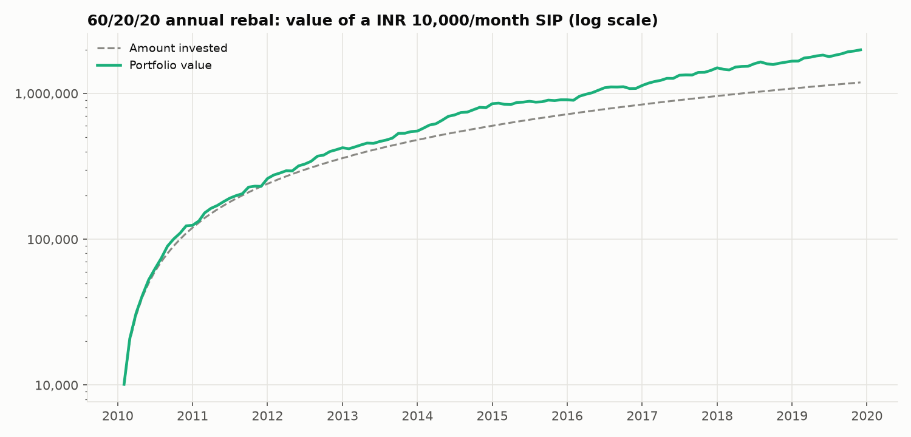
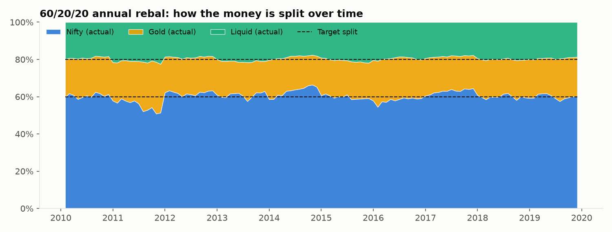
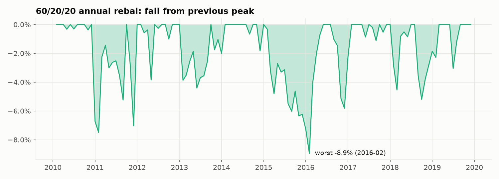

# Strategy 3: 60/20/20 SIP (Nifty / Gold / Liquid, reset yearly)

> **Idea:** The classic fixed mix: 60% equity for growth, 20% gold and 20% liquid for protection, reset to exactly 60/20/20 once a year.

## The rule

1. Every month, invest **₹6,000 in Nifty, ₹2,000 in Gold, ₹2,000 in Liquid**.
2. Every 12 months, sell what has grown above its share and buy what has fallen below it.

## The formulas this strategy uses

Every example uses the first SIP month, **Feb 2010**, when the month's returns were
Nifty +0.93%, Gold +3.17%, Liquid +0.31% (built in `00_raw_data/`).

### 1. Deciding the split

**Target weights (fixed)**

```
w_t = (w_Nifty, w_Gold, w_Liquid) = 60% / 20% / 20%   for every month t
```

| Term | What it stands for |
|---|---|
| `w_t` | the split the strategy aims for in month t |
| `w_Nifty, w_Gold, w_Liquid` | shares of the portfolio for each asset (they add to 100%) |

**Example:** Feb 2010 (and every other month): Nifty 60.0% / Gold 20.0% / Liquid 20.0%.

**Code:** [`03_fixed_60_20_20_sip/strategy.py` line 22](../03_fixed_60_20_20_sip/strategy.py#L22): `WEIGHTS = {"Nifty": 0.60, "Gold": 0.20, "Liquid": 0.20}`<br>[`03_fixed_60_20_20_sip/strategy.py` line 27](../03_fixed_60_20_20_sip/strategy.py#L27): `target = fixed_weights(returns.index, WEIGHTS)`<br>[`sip/optimize.py` line 55](../sip/optimize.py#L55): `return pd.DataFrame([weights] * len(index), index=index)`

### 2. Investing each month (the shared SIP engine)

**Instalment**

```
C_t = A × (1 + g)^floor(t / 12)
```

| Term | What it stands for |
|---|---|
| `C_t` | money invested in month t |
| `A` | monthly amount = ₹10,000 |
| `g` | yearly step-up (0 in this study) |
| `t` | months since the SIP started |

**Example:** Feb 2010 (t = 0): C = ₹10,000 × (1 + 0)^0 = **₹10,000**.

**Code:** [`sip/engine.py` line 58](../sip/engine.py#L58): `return pd.Series(amount * (1.0 + step_up) ** years, index=index, name="contribution")`

**Splitting the instalment (pro-rata)**

```
buy_i = w_i × C_t
```

| Term | What it stands for |
|---|---|
| `buy_i` | money put into asset i this month |
| `w_i` | target weight of asset i |
| `C_t` | this month's instalment |

**Example:** Feb 2010: Nifty 0.6000 × ₹10,000 = **₹6,000.00**, Gold 0.2000 × ₹10,000 = **₹2,000.00**, Liquid 0.2000 × ₹10,000 = **₹2,000.00**.

**Code:** [`sip/engine.py` line 96](../sip/engine.py#L96): `split = _smart_split(h, w, cash) if strategy.contribution == "smart" else w * cash`

**Rebalancing (every 12 months)**

```
every 12th month:  trade_i = w_i × Σ_j h_j − h_i
(trade_i > 0 → buy, trade_i < 0 → sell)
```

| Term | What it stands for |
|---|---|
| `trade_i` | rupees bought (+) or sold (−) of asset i |
| `w_i` | target weight |
| `h_i` | holding of asset i after this month's instalment |
| `Σ_j h_j` | total portfolio value |

**Example:** First rebalance 2011-01: after the instalment the split was Nifty 61.2% / Gold 20.4% / Liquid 18.5% of ₹133,625, so **Nifty −₹1,582 / Gold −₹483 / Liquid ₹2,066** (sell Nifty and Gold, buy Liquid) brings it back to 60 / 20 / 20. 9 rebalances in 119 months.

**Code:** [`sip/engine.py` line 103](../sip/engine.py#L103): `if strategy.rebalance == "calendar" and months_since_rebal >= strategy.rebalance_every:`<br>[`sip/engine.py` line 108](../sip/engine.py#L108): `trade = w * h.sum() - h`

**Trading cost**

```
cost_t = (Σ bought + Σ sold) × 0.10%
```

| Term | What it stands for |
|---|---|
| `cost_t` | rupees lost to costs this month |
| `Σ bought` | all purchases this month |
| `Σ sold` | all sales this month |
| `0.10%` | 10 basis points per rupee traded |

**Example:** Feb 2010: (₹10,000 + ₹0) × 0.001 = **₹10**, taken from each asset in proportion, leaving Nifty ₹5,994.00 / Gold ₹1,998.00 / Liquid ₹1,998.00.

**Code:** [`sip/engine.py` line 116](../sip/engine.py#L116): `costs[t] = turnover * cost_rate`<br>[`sip/engine.py` line 118](../sip/engine.py#L118): `h = h * (1.0 - costs[t] / start_value)`

**Market move**

```
h_i ← h_i × (1 + r_i,t)
```

| Term | What it stands for |
|---|---|
| `h_i` | rupees held in asset i |
| `r_i,t` | asset i's return this month (from `00_raw_data/`) |

**Example:** Feb 2010 returns: Nifty +0.93%, Gold +3.17%, Liquid +0.31%. So Nifty ₹5,994.00 × 1.0093 = **₹6,049.91**, Gold ₹1,998.00 × 1.0317 = **₹2,061.36**, Liquid ₹1,998.00 × 1.0031 = **₹2,004.29**; portfolio **₹10,115.57**.

**Code:** [`sip/engine.py` line 122](../sip/engine.py#L122): `h = h * (1.0 + rets[t])`

**Monthly return of the strategy (time-weighted)**

```
TWR_t = V_end,t / V_start,t − 1
```

| Term | What it stands for |
|---|---|
| `TWR_t` | the strategy's return in month t, ignoring the new money |
| `V_end,t` | value at the end of the month |
| `V_start,t` | value right after the instalment, before costs |

**Example:** Feb 2010: ₹10,115.57 / ₹10,000 − 1 = **+1.16%**.

**Code:** [`sip/engine.py` line 124](../sip/engine.py#L124): `twr[t] = h.sum() / start_value - 1.0`

## How it behaves over time

The allocation chart shows the split drifting during each year and snapping back to 60/20/20 every January (9 rebalances).

## Results

**Setup (identical for all six strategies):** ₹10,000 on the 1st of every month from
**Feb 2010 to Dec 2019** (119 instalments, **₹1,190,000 invested**),
0.1% cost on every trade, rupee returns from `00_raw_data/`.

| Measure | Value | What it means |
|---|---|---|
| Final value | **₹1,990,520** | What ₹1,190,000 grew into (1.67×) |
| XIRR | **10.0%** | Yearly return earned on your SIP money |
| Volatility | 8.8% | How bumpy the ride was (yearly) |
| Sharpe (vs 0%) | 1.15 | Return per unit of bumpiness |
| **Sharpe vs Liquid** | **0.33** | Return *above the T-bill rate* per unit of bumpiness (the fair one) |
| Max drawdown | -8.9% | Worst fall of the strategy itself |
| Worst fall in account | -4.0% | Biggest drop in rupees you would have seen |
| Selling per year | 2.4% | Share of the portfolio sold yearly |

For reference, a SIP kept **100% in Liquid** earned an XIRR of **7.3%**.

**Every possible 5-year SIP** (60 start dates from Feb 2010; only
5-year windows fit in the 10-year SIP period):

| Median XIRR | Worst XIRR | Best XIRR | % that lost money | Typical worst fall | Worst fall (any) |
|---|---|---|---|---|---|
| 9.7% | 6.1% | 13.9% | 0.0% | -2.0% | -2.8% |

**Through Indian market stress periods** (return of the strategy over each period):

| Period | Return |
|---|---|
| 2011 slowdown + euro crisis (Jan-Dec 2011) | -6.9% |
| 2013 taper tantrum, rupee crash (Jun-Aug 2013) | -1.7% |
| 2015-16 China/global sell-off (Mar 2015-Feb 2016) | -8.7% |
| 2018 IL&FS crisis (Sep-Oct 2018) | -5.2% |

### Charts







### How each score is calculated

**XIRR (the yearly return earned on your SIP money)**

```
Σ_k CF_k / (1 + XIRR)^(t_k) = 0
```

| Term | What it stands for |
|---|---|
| `CF_k` | cash flow k: every instalment is negative (money in), the final value positive |
| `t_k` | time of cash flow k in years (0, 1/12, 2/12, …) |
| `XIRR` | the one yearly rate that makes all cash flows balance |

**Example:** If the SIP stopped after month 1: −₹10,000 at t = 0 and +₹10,115.57 at t = 1/12, so XIRR = (10,115.57 / 10,000.00)^12 − 1 = **14.78%**. Over all 119 instalments it is **10.02%**.

**Code:** [`sip/metrics.py` line 21](../sip/metrics.py#L21): `return np.sum(cashflows / (1.0 + r) ** years)`<br>[`sip/metrics.py` line 28](../sip/metrics.py#L28): `cfs = np.append(-res.contributions.values, res.total.iloc[-1])`

**Volatility (how bumpy the ride is)**

```
σ = std(TWR_1 … TWR_N) × √12
```

| Term | What it stands for |
|---|---|
| `σ` | yearly volatility |
| `TWR_t` | monthly returns of the strategy |
| `√12` | turns a monthly spread into a yearly one |

**Example:** First 12 months (Feb 2010 – Jan 2011): std of the 12 monthly returns = 3.248% × 3.464 = **11.25%**.

**Code:** [`sip/metrics.py` line 41](../sip/metrics.py#L41): `ann_vol = r.std() * np.sqrt(MONTHS)`

**Sharpe ratio (return per unit of bumpiness, against 0%)**

```
Sharpe = 12 × mean(TWR_t) / σ
```

| Term | What it stands for |
|---|---|
| `mean(TWR_t)` | average monthly return |
| `12 ×` | turns it into a yearly return |
| `σ` | yearly volatility (above) |

**Example:** First 12 months: 12 × 1.160% / 11.25% = **1.24**.

**Code:** [`sip/metrics.py` line 56](../sip/metrics.py#L56): `"Sharpe": excess.mean() * MONTHS / ann_vol,`

**Sharpe vs Liquid (return above the T-bill rate, per unit of bumpiness)**

```
Sharpe_vs_Liquid = 12 × mean(TWR_t − r_Liquid,t) / σ
```

| Term | What it stands for |
|---|---|
| `r_Liquid,t` | the Liquid fund's return that month (≈ 91-day T-bill) |
| `TWR_t − r_Liquid,t` | what the strategy earned above simply holding Liquid |
| `σ` | yearly volatility of the strategy |

**Example:** First 12 months: 12 × (1.160% − 0.471%) / 11.25% = **0.73**. This is the fair comparison when a near-cash asset is available (see `07_comparison/`).

**Code:** [`sip/metrics.py` line 71](../sip/metrics.py#L71): `out["Sharpe vs Liquid"] = excess_vs_rf.mean() * MONTHS / ann_vol`

**Max drawdown (worst fall of the strategy from a previous peak)**

```
G_t = Π_{s≤t} (1 + TWR_s)          MDD = min_t ( G_t / max_{s≤t} G_s − 1 )
```

| Term | What it stands for |
|---|---|
| `G_t` | growth of ₹1 invested in the strategy |
| `max_{s≤t} G_s` | highest value so far |
| `MDD` | the deepest percentage fall from a peak |

**Example:** First 12 months: deepest fall **-6.72%**. Whole SIP: see results below.

**Code:** [`sip/metrics.py` line 35](../sip/metrics.py#L35): `return float((series / peak - 1.0).min())`

**Worst fall in the account (what you would actually have seen)**

```
Worst fall = min_t ( V_t / max_{s≤t} V_s − 1 )
```

| Term | What it stands for |
|---|---|
| `V_t` | account value in rupees at the end of month t (includes new instalments) |

**Example:** First 12 months: **0.00%** (new instalments hide small dips; the account ended Jan 2011 at ₹124,640 on ₹1,20,000 invested).

**Code:** [`sip/metrics.py` line 61](../sip/metrics.py#L61): `"Worst wealth drop": max_drawdown(res.total),`

**Selling per year (a proxy for tax events)**

```
Sell turnover = Σ_t sold_t / mean(V_t) / years
```

| Term | What it stands for |
|---|---|
| `sold_t` | rupees sold in month t |
| `mean(V_t)` | average account value |
| `years` | length of the SIP = 119 / 12 = 9.92 |

**Example:** Whole SIP: ₹197,186 sold / ₹838,106 average / 9.92 years = **2.37%** a year.

**Code:** [`sip/metrics.py` line 63](../sip/metrics.py#L63): `"Annual sell turnover": res.sold.sum() / res.total.mean() / (len(r) / MONTHS),`

## Strengths and weaknesses

**Strengths**
- **Best Sharpe vs Liquid of all six (0.33)**: the most return above the T-bill rate per unit of risk.
- Second-highest return (10.0%), with a worst account fall of only -4.0%.

**Weaknesses**
- Still equity-heavy: it fell -6.9% in 2011 and -8.7% in 2015-16.
- Sells every year (about 2.4% of the portfolio), so there are tax events.

## Files in this folder

| File | What it is |
|---|---|
| `strategy.py` | **The rule, in code.** Run it to regenerate `results/` |
| `results/summary.md` | All results on one page (also `summary.csv`) |
| `results/monthly.csv` | Month by month: instalment, rupees in each asset, target and actual split, bought/sold, costs |
| `results/rolling_5y_windows.csv` | XIRR and worst fall of every 5-year SIP |
| `results/crises.csv` | Return in each stress period |
| `results/*.png` | The three charts above |

## How to run

```bash
python 03_fixed_60_20_20_sip/strategy.py
```

It reads the prepared returns table in `00_raw_data/`, runs the SIP month by month with the
shared engine in `sip/` (identical for all six strategies) and rewrites `results/`.
