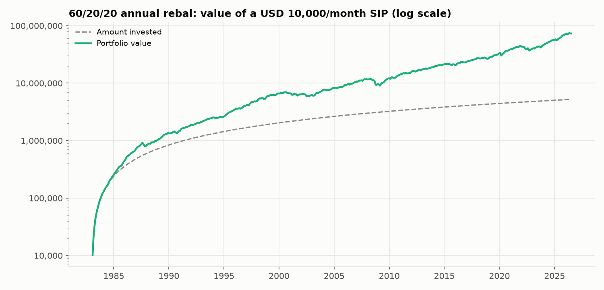
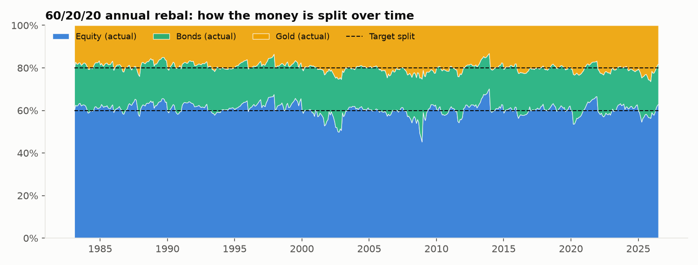
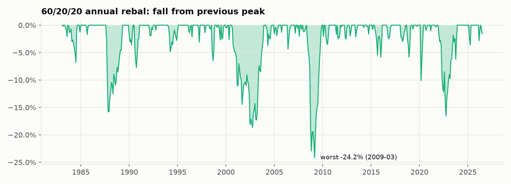

# Strategy 3: 60/20/20 SIP (fixed mix, reset yearly)

> **Idea:** The classic fixed mix: 60% stocks for growth, 20% bonds and 20% gold for protection, reset to exactly 60/20/20 once a year. It's based on the well-known 60/40 stock/bond portfolio, with the 40% split between bonds and gold.

## The rule

1. Every month, invest **6,000 in equity, 2,000 in bonds, 2,000 in gold**.
2. Every 12 months, **rebalance**: sell whatever has grown above its share and buy what
   has fallen below it, so the portfolio is back at exactly 60/20/20.

## The formula

Target weights (every month):

    w = (Equity 60%, Bonds 20%, Gold 20%)

Rebalance (every 12th month), for each asset i:

    trade_i = w_i × (total portfolio value) − (current value of asset i)
    (positive = buy, negative = sell)

## Worked example: your first month (Feb 1983)

Returns that month: Equity +2.13%, Bonds −0.69%, Gold +2.08% (see `00_raw_data/`).

| | Equity | Bonds | Gold | Total |
|---|---|---|---|---|
| Invest | 6,000 | 2,000 | 2,000 | 10,000 |
| After 0.1% cost | 5,994 | 1,998 | 1,998 | 9,990 |
| × Feb 1983 return | +2.13% → 6,122 | −0.69% → 1,984 | +2.08% → 2,040 | **10,145** |

**First rebalance (Jan 1984):** after a year the split had drifted to 62.1 / 19.9 / 18.0
(equity grew, gold fell), so 2,357 of equity was sold and moved back into bonds and gold.

## How it behaves over time

The allocation chart shows the split drifting during each year and snapping back to 60/20/20 every January: 43 rebalances in total.

## Results

**Setup (identical for all six strategies):** 10,000 invested on the 1st of every month
from **Feb 1983 to Jul 2026** (522 instalments, **5,220,000 invested**), 0.1% cost on
every trade, USD data (rupee version below).

| Measure | Value | What it means |
|---|---|---|
| Final value | **73,278,511** | What the 5,220,000 grew into (14.0×) |
| XIRR | **9.8%** | Yearly return earned on your SIP money |
| Volatility | 7.6% | How bumpy the ride was (yearly) |
| Sharpe ratio | **1.29** | Return per unit of bumpiness (higher = better) |
| Worst fall in account | **-23.4%** | Biggest drop from a peak you would have seen |
| Max drawdown (returns) | -24.2% | Same idea, ignoring new instalments |
| Selling per year | 3.8% | Share of the portfolio sold yearly (tax proxy) |

**Every possible 10-year SIP** (403 start dates, Feb 1983 onwards):

| Median XIRR | Worst XIRR | Best XIRR | % that lost money | Typical worst fall | Worst fall (any) |
|---|---|---|---|---|---|
| 9.0% | 1.7% | 14.3% | 0.0% | -8.6% | -21.4% |

**Through market crashes** (return of the portfolio during each period):

| Period | Return |
|---|---|
| 1987 crash (Sep-Nov 1987) | -15.8% |
| Dot-com bust (Sep 2000-Sep 2002) | -17.9% |
| Global financial crisis (Nov 2007-Feb 2009) | -21.2% |
| COVID crash (Feb-Mar 2020) | -9.2% |
| 2022 rate shock (Jan-Sep 2022) | -14.2% |

**Rupee investor (same assets, returns converted to INR):** final value
395,730,115, XIRR **15.2%**, Sharpe 1.74, worst fall
-14.0%, 0.0% of 10-year SIPs lost money.

### Charts







## Strengths and weaknesses

**Strengths**
- **Second-highest return** (9.8% a year) with less than half the worst fall of 100% equity (−23% vs −48%).
- Easy to explain and to follow in real life.

**Weaknesses**
- Still equity-heavy, so it falls hard in stock crashes (−21% in 2008–09, −40% for stocks).
- Sells every year whether needed or not (about 3.8% of the portfolio per year, which means tax events).
- The 60/20/20 split is a convention, not derived from data.

## Files in this folder

| File | What it is |
|---|---|
| `strategy.py` | **The rule, in code.** Run it to regenerate everything below |
| `results/usd/summary.md` | All results in one page (also `summary.csv`) |
| `results/usd/monthly.csv` | Month-by-month: instalment, value of each asset, target and actual split, amount bought/sold, costs |
| `results/usd/rolling_10y_windows.csv` | XIRR and worst fall of each of the 403 ten-year SIPs |
| `results/usd/crises.csv` | Return in each crash period |
| `results/usd/*.png` | The three charts above |
| `results/inr/` | The same files for a rupee investor |

## How to run

```bash
python 03_fixed_60_20_20_sip/strategy.py
```

It reads the prepared returns table from `00_raw_data/`, runs the SIP month by month
using the shared engine in `sip/` (the same for all six strategies) and rewrites
`results/`.
