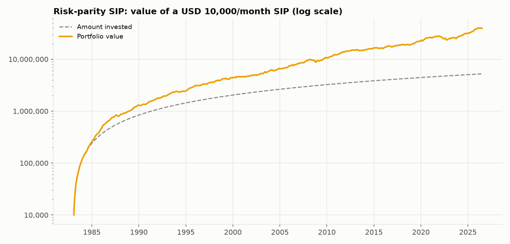
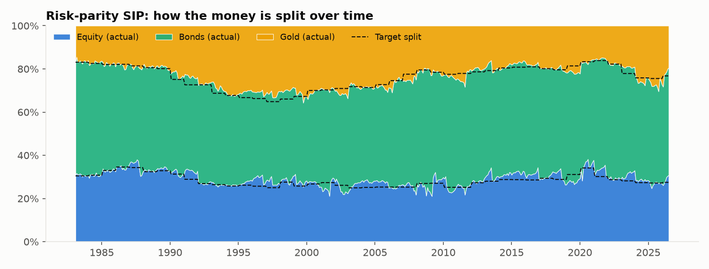
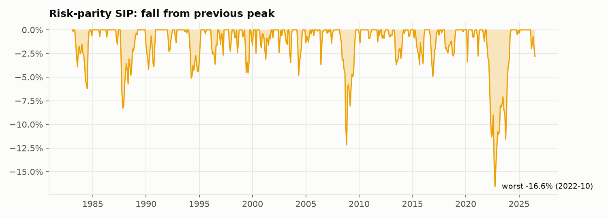

# Strategy 4: Risk-parity SIP

> **Idea:** Let a formula decide the split so that **each asset contributes the same amount of risk**. Calm assets (bonds) get more money; jumpy assets (gold) get less. It never needs to guess future returns.

## The rule

1. Every 12 months, look at **only the previous 120 months** (10 years) of returns.
2. Measure how much each asset wobbles and how they move together (the covariance matrix Σ).
3. Choose weights so every asset contributes **equal risk**, keeping each asset between **10% and 70%**.
4. Each month, send the instalment to the assets **below their target** first (no selling).
5. Only rebalance (sell) if an asset drifts **more than 5 points** from its target.

## The formula

Risk contribution of asset i:

    RC_i = w_i × (Σ w)_i          (its share of total portfolio variance)

Choose w to make all RC_i equal:

    minimise  Σ_i (RC_i − average RC)²
    subject to  w_Equity + w_Bonds + w_Gold = 1,   0.10 ≤ w_i ≤ 0.70

Σ = covariance matrix of the last 120 monthly returns.

## Worked example: your first month (Feb 1983)

Returns that month: Equity +2.13%, Bonds −0.69%, Gold +2.08% (see `00_raw_data/`).

On 1 Feb 1983 the optimizer looks at Feb 1973 – Jan 1983:

| | Equity | Bonds | Gold |
|---|---|---|---|
| Volatility (1973–83) | 14.1% | 9.0% | 29.5% |
| **Risk-parity weight** | **30.5%** | **52.6%** | **16.9%** |
| Share of total risk | 33.3% | 33.3% | 33.3% ✓ |
| Money invested (of 10,000) | 3,048 | 5,262 | 1,690 |
| End of Feb 1983 (after cost and returns) | 3,110 | 5,220 | 1,723 |

Gold is three times as jumpy as bonds, so it gets about a third as much money.

## How it behaves over time

The target (dashed line in the allocation chart) is recomputed every February. It stays bond-heavy (about 50%), which is why this SIP is so calm. It rebalanced only 27 times in 522 months, because the smart instalments keep it close to target.

## Results

**Setup (identical for all six strategies):** 10,000 invested on the 1st of every month
from **Feb 1983 to Jul 2026** (522 instalments, **5,220,000 invested**), 0.1% cost on
every trade, USD data (rupee version below).

| Measure | Value | What it means |
|---|---|---|
| Final value | **39,079,131** | What the 5,220,000 grew into (7.5×) |
| XIRR | **7.7%** | Yearly return earned on your SIP money |
| Volatility | 5.5% | How bumpy the ride was (yearly) |
| Sharpe ratio | **1.44** | Return per unit of bumpiness (higher = better) |
| Worst fall in account | **-16.3%** | Biggest drop from a peak you would have seen |
| Max drawdown (returns) | -16.6% | Same idea, ignoring new instalments |
| Selling per year | 5.3% | Share of the portfolio sold yearly (tax proxy) |

**Every possible 10-year SIP** (403 start dates, Feb 1983 onwards):

| Median XIRR | Worst XIRR | Best XIRR | % that lost money | Typical worst fall | Worst fall (any) |
|---|---|---|---|---|---|
| 7.3% | 3.5% | 10.8% | 0.0% | -3.4% | -11.1% |

**Through market crashes** (return of the portfolio during each period):

| Period | Return |
|---|---|
| 1987 crash (Sep-Nov 1987) | -8.3% |
| Dot-com bust (Sep 2000-Sep 2002) | 3.9% |
| Global financial crisis (Nov 2007-Feb 2009) | 0.3% |
| COVID crash (Feb-Mar 2020) | -1.8% |
| 2022 rate shock (Jan-Sep 2022) | -14.1% |

**Rupee investor (same assets, returns converted to INR):** final value
227,250,222, XIRR **13.4%**, Sharpe 1.80, worst fall
-8.2%, 0.0% of 10-year SIPs lost money.

### Charts







## Strengths and weaknesses

**Strengths**
- **Safest of all six**: worst fall only 16%, and the lowest volatility (5.5%).
- **Highest Sharpe ratio of all six (1.44)**: the best return per unit of risk.
- Stayed flat through 2008–09 (+0.3%) and rose in the dot-com crash (+3.9%).
- Doesn't depend on return forecasts, which are the least reliable input.

**Weaknesses**
- **Lowest return** (7.7% a year): being bond-heavy costs growth.
- Suffered in 2022 (−14%), when stocks and bonds fell together.
- Its bond-heavy mix benefited from 40 years of falling interest rates (1983–2020), which may not repeat.

## Files in this folder

| File | What it is |
|---|---|
| `strategy.py` | **The rule, in code.** Run it to regenerate everything below |
| `results/usd/summary.md` | All results in one page (also `summary.csv`) |
| `results/usd/monthly.csv` | Month-by-month: instalment, value of each asset, target and actual split, amount bought/sold, costs |
| `results/usd/rolling_10y_windows.csv` | XIRR and worst fall of each of the 403 ten-year SIPs |
| `results/usd/crises.csv` | Return in each crash period |
| `results/usd/*.png` | The three charts above |
| `results/inr/` | The same files for a rupee investor |

## How to run

```bash
python 04_risk_parity_sip/strategy.py
```

It reads the prepared returns table from `00_raw_data/`, runs the SIP month by month
using the shared engine in `sip/` (the same for all six strategies) and rewrites
`results/`.
