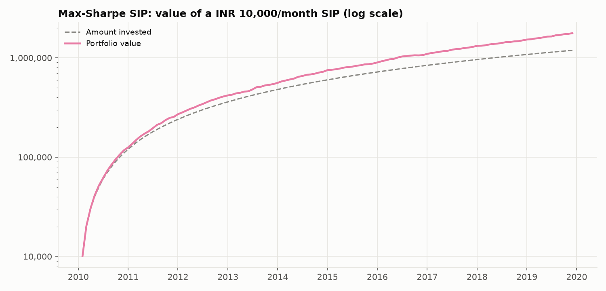
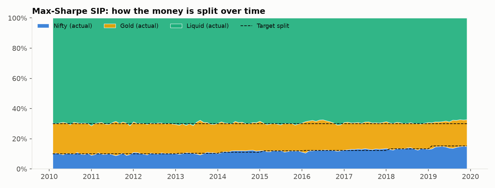
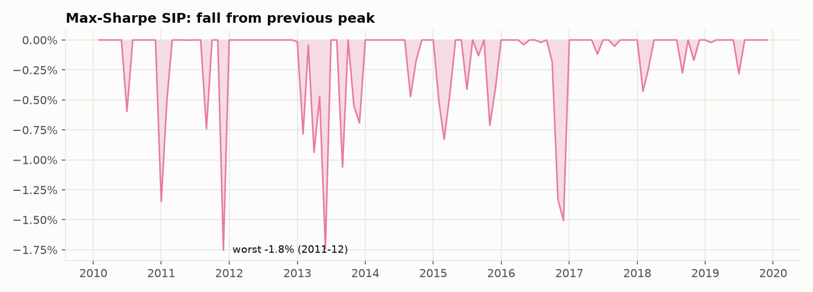

# Strategy 5: Max-Sharpe SIP

> **Idea:** Let a formula choose the split with the most return per unit of risk over the last 10 years (Markowitz).

## The rule

1. Every 12 months, look at **only the previous 120 months**.
2. Estimate average returns (μ) and covariance (Σ); choose weights that maximise return ÷ risk, each between **10% and 70%**.
3. Each month, send the instalment to the assets **below target** first.
4. Only rebalance if an asset drifts **more than 5 points** from target.

## The formulas this strategy uses

Every example uses the first SIP month, **Feb 2010**, when the month's returns were
Nifty +0.93%, Gold +3.17%, Liquid +0.31% (built in `00_raw_data/`).

### 1. Deciding the split

**Estimates from the past 120 months only (no look-ahead)**

```
μ_i  = (1/120) × Σ_{s=t−120}^{t−1} r_i,s
Σ_ij = (1/119) × Σ_s (r_i,s − μ_i)(r_j,s − μ_j)
```

| Term | What it stands for |
|---|---|
| `μ_i` | average monthly return of asset i over the last 120 months |
| `Σ_ij` | covariance of assets i and j (Σ_ii = variance; √(12·Σ_ii) = yearly volatility) |
| `r_i,s` | return of asset i in month s |
| `t` | the month being decided (re-fitted every 12 months) |

**Example:** For Feb 2010 the window is Feb 2000 – Jan 2010. Average return per year (12 × μ): Nifty 16.8% / Gold 15.3% / Liquid 6.2%; yearly volatility: Nifty 28.0% / Gold 16.8% / Liquid 0.5%. Liquid barely moves (volatility under 0.5%), which is what drives the result below.

**Code:** [`sip/optimize.py` line 74](../sip/optimize.py#L74): `current = fn(rets.iloc[i - lookback:i], lo=lo, hi=hi)`<br>[`sip/optimize.py` line 29](../sip/optimize.py#L29): `return max_sharpe_mu(rets.mean().values - rf / MONTHS, rets.cov().values, lo, hi)`

**Max Sharpe**

```
maximise  (w · μ) / √(wᵀ Σ w)
```

| Term | What it stands for |
|---|---|
| `w · μ` | expected monthly return of the portfolio |
| `√(wᵀ Σ w)` | monthly volatility of the portfolio |
| `ratio` | return per unit of risk, measured against 0% (no risk-free rate subtracted) |

**Example:** Feb 2010: weights Nifty 10.0% / Gold 20.0% / Liquid 70.0% (Nifty at its 10% floor, Liquid at its 70% cap): expected 9.1% a year with 4.5% volatility, ratio 2.03. Because the ratio is measured against 0%, Liquid's steady ~6% with almost no volatility looks extremely attractive.

**Code:** [`sip/optimize.py` line 34](../sip/optimize.py#L34): `return _solve(lambda w: -(w @ mu) / np.sqrt(w @ cov @ w), len(mu), lo, hi)`

**Constraints (both optimisers)**

```
Σ_i w_i = 1        0.10 ≤ w_i ≤ 0.70
```

| Term | What it stands for |
|---|---|
| `w_i` | weight of asset i |
| `0.10 / 0.70` | every asset gets at least 10% and at most 70% |

**Example:** Without these limits the optimisers would put almost everything in Liquid: risk parity Nifty 1.5% / Gold 2.3% / Liquid 96.2%, max Sharpe Nifty 0.5% / Gold 0.4% / Liquid 99.1% (Feb 2010). The 70% cap is what keeps any Nifty and Gold in the portfolio.

**Code:** [`sip/optimize.py` line 16](../sip/optimize.py#L16): `res = minimize(objective, x0, method="SLSQP", bounds=[(lo, hi)] * n,`<br>[`sip/optimize.py` line 17](../sip/optimize.py#L17): `constraints=({"type": "eq", "fun": lambda w: w.sum() - 1.0},),`

### 2. Investing each month (the shared SIP engine)

**Instalment**

```
C_t = A × (1 + g)^floor(t / 12)
```

| Term | What it stands for |
|---|---|
| `C_t` | money invested in month t |
| `A` | monthly amount = ₹10,000 |
| `g` | yearly step-up (0 in this study) |
| `t` | months since the SIP started |

**Example:** Feb 2010 (t = 0): C = ₹10,000 × (1 + 0)^0 = **₹10,000**.

**Code:** [`sip/engine.py` line 58](../sip/engine.py#L58): `return pd.Series(amount * (1.0 + step_up) ** years, index=index, name="contribution")`

**Splitting the instalment (smart: fill the gaps first, never sell)**

```
V     = Σ_i h_i + C_t
gap_i = max(w_i × V − h_i, 0)
need  = Σ_i gap_i
buy_i = gap_i / need × C_t              if need ≥ C_t
buy_i = gap_i + w_i × (C_t − need)      if need < C_t
```

| Term | What it stands for |
|---|---|
| `h_i` | money currently held in asset i |
| `V` | portfolio value after adding the instalment |
| `w_i` | target weight of asset i |
| `gap_i` | how far asset i is below its target, in rupees |
| `need` | total of all gaps |
| `C_t` | this month's instalment |
| `buy_i` | money put into asset i |

**Example:** Month 1 (Feb 2010) starts empty, so every gap equals w_i × ₹10,000: Nifty ₹1,000.00, Gold ₹2,000.00, Liquid ₹7,000.00. Month 2 (Mar 2010): holdings Nifty ₹1,008.32 / Gold ₹2,061.36 / Liquid ₹7,015.03, V = ₹10,084.71 + ₹10,000 = ₹20,084.71; gaps Nifty ₹1,000.15 / Gold ₹1,955.58 / Liquid ₹7,044.27 (need = ₹10,000.00), so the instalment buys **Nifty ₹1,000.15 / Gold ₹1,955.58 / Liquid ₹7,044.27**.

**Code:** [`sip/engine.py` line 63](../sip/engine.py#L63): `total = holdings.sum() + cash`<br>[`sip/engine.py` line 64](../sip/engine.py#L64): `gap = np.maximum(target * total - holdings, 0.0)`<br>[`sip/engine.py` line 69](../sip/engine.py#L69): `return gap / need * cash`<br>[`sip/engine.py` line 70](../sip/engine.py#L70): `return gap + target * (cash - need)`

**Rebalancing (only when the drift is too big)**

```
drift = max_i | h_i / Σ_j h_j − w_i |
if drift > 5%:  trade_i = w_i × Σ_j h_j − h_i
```

| Term | What it stands for |
|---|---|
| `drift` | largest gap between an asset's actual share and its target |
| `h_i` | holding of asset i |
| `w_i` | target weight |
| `5%` | the tolerance band |
| `trade_i` | rupees bought (+) or sold (−) of asset i |

**Example:** After month 1 the actual split was Nifty 10.0% / Gold 20.4% / Liquid 69.6% against a target of Nifty 10.0% / Gold 20.0% / Liquid 70.0%: drift 0.44%, well under 5%, so nothing is sold. Over the whole SIP this rule fired **0 times** (the smart instalments kept the split on target).

**Code:** [`sip/engine.py` line 106](../sip/engine.py#L106): `do_rebal = np.abs(h / h.sum() - w).max() > strategy.band`<br>[`sip/engine.py` line 108](../sip/engine.py#L108): `trade = w * h.sum() - h`

**Trading cost**

```
cost_t = (Σ bought + Σ sold) × 0.10%
```

| Term | What it stands for |
|---|---|
| `cost_t` | rupees lost to costs this month |
| `Σ bought` | all purchases this month |
| `Σ sold` | all sales this month |
| `0.10%` | 10 basis points per rupee traded |

**Example:** Feb 2010: (₹10,000 + ₹0) × 0.001 = **₹10**, taken from each asset in proportion, leaving Nifty ₹999.00 / Gold ₹1,998.00 / Liquid ₹6,993.00.

**Code:** [`sip/engine.py` line 116](../sip/engine.py#L116): `costs[t] = turnover * cost_rate`<br>[`sip/engine.py` line 118](../sip/engine.py#L118): `h = h * (1.0 - costs[t] / start_value)`

**Market move**

```
h_i ← h_i × (1 + r_i,t)
```

| Term | What it stands for |
|---|---|
| `h_i` | rupees held in asset i |
| `r_i,t` | asset i's return this month (from `00_raw_data/`) |

**Example:** Feb 2010 returns: Nifty +0.93%, Gold +3.17%, Liquid +0.31%. So Nifty ₹999.00 × 1.0093 = **₹1,008.32**, Gold ₹1,998.00 × 1.0317 = **₹2,061.36**, Liquid ₹6,993.00 × 1.0031 = **₹7,015.03**; portfolio **₹10,084.71**.

**Code:** [`sip/engine.py` line 122](../sip/engine.py#L122): `h = h * (1.0 + rets[t])`

**Monthly return of the strategy (time-weighted)**

```
TWR_t = V_end,t / V_start,t − 1
```

| Term | What it stands for |
|---|---|
| `TWR_t` | the strategy's return in month t, ignoring the new money |
| `V_end,t` | value at the end of the month |
| `V_start,t` | value right after the instalment, before costs |

**Example:** Feb 2010: ₹10,084.71 / ₹10,000 − 1 = **+0.85%**.

**Code:** [`sip/engine.py` line 124](../sip/engine.py#L124): `twr[t] = h.sum() / start_value - 1.0`

## How it behaves over time

Measured against 0%, Liquid's steady return with almost no volatility dominates, so the target pinned Liquid at the 70% cap and Nifty near its 10% floor (2010: 10%/20%/70%, 2011: 10%/20%/70%, 2012: 10%/20%/70% …).

## Results

**Setup (identical for all six strategies):** ₹10,000 on the 1st of every month from
**Feb 2010 to Dec 2019** (119 instalments, **₹1,190,000 invested**),
0.1% cost on every trade, rupee returns from `00_raw_data/`.

| Measure | Value | What it means |
|---|---|---|
| Final value | **₹1,770,116** | What ₹1,190,000 grew into (1.49×) |
| XIRR | **7.8%** | Yearly return earned on your SIP money |
| Volatility | 3.2% | How bumpy the ride was (yearly) |
| Sharpe (vs 0%) | 2.49 | Return per unit of bumpiness |
| **Sharpe vs Liquid** | **0.24** | Return *above the T-bill rate* per unit of bumpiness (the fair one) |
| Max drawdown | -1.8% | Worst fall of the strategy itself |
| Worst fall in account | -0.2% | Biggest drop in rupees you would have seen |
| Selling per year | 0.0% | Share of the portfolio sold yearly |

For reference, a SIP kept **100% in Liquid** earned an XIRR of **7.3%**.

**Every possible 5-year SIP** (60 start dates from Feb 2010; only
5-year windows fit in the 10-year SIP period):

| Median XIRR | Worst XIRR | Best XIRR | % that lost money | Typical worst fall | Worst fall (any) |
|---|---|---|---|---|---|
| 7.3% | 6.5% | 9.0% | 0.0% | 0.0% | 0.0% |

**Through Indian market stress periods** (return of the strategy over each period):

| Period | Return |
|---|---|
| 2011 slowdown + euro crisis (Jan-Dec 2011) | 9.1% |
| 2013 taper tantrum, rupee crash (Jun-Aug 2013) | 4.2% |
| 2015-16 China/global sell-off (Mar 2015-Feb 2016) | 5.2% |
| 2018 IL&FS crisis (Sep-Oct 2018) | 0.4% |

### Charts







### How each score is calculated

**XIRR (the yearly return earned on your SIP money)**

```
Σ_k CF_k / (1 + XIRR)^(t_k) = 0
```

| Term | What it stands for |
|---|---|
| `CF_k` | cash flow k: every instalment is negative (money in), the final value positive |
| `t_k` | time of cash flow k in years (0, 1/12, 2/12, …) |
| `XIRR` | the one yearly rate that makes all cash flows balance |

**Example:** If the SIP stopped after month 1: −₹10,000 at t = 0 and +₹10,084.71 at t = 1/12, so XIRR = (10,084.71 / 10,000.00)^12 − 1 = **10.65%**. Over all 119 instalments it is **7.77%**.

**Code:** [`sip/metrics.py` line 21](../sip/metrics.py#L21): `return np.sum(cashflows / (1.0 + r) ** years)`<br>[`sip/metrics.py` line 28](../sip/metrics.py#L28): `cfs = np.append(-res.contributions.values, res.total.iloc[-1])`

**Volatility (how bumpy the ride is)**

```
σ = std(TWR_1 … TWR_N) × √12
```

| Term | What it stands for |
|---|---|
| `σ` | yearly volatility |
| `TWR_t` | monthly returns of the strategy |
| `√12` | turns a monthly spread into a yearly one |

**Example:** First 12 months (Feb 2010 – Jan 2011): std of the 12 monthly returns = 0.922% × 3.464 = **3.19%**.

**Code:** [`sip/metrics.py` line 41](../sip/metrics.py#L41): `ann_vol = r.std() * np.sqrt(MONTHS)`

**Sharpe ratio (return per unit of bumpiness, against 0%)**

```
Sharpe = 12 × mean(TWR_t) / σ
```

| Term | What it stands for |
|---|---|
| `mean(TWR_t)` | average monthly return |
| `12 ×` | turns it into a yearly return |
| `σ` | yearly volatility (above) |

**Example:** First 12 months: 12 × 0.791% / 3.19% = **2.97**.

**Code:** [`sip/metrics.py` line 56](../sip/metrics.py#L56): `"Sharpe": excess.mean() * MONTHS / ann_vol,`

**Sharpe vs Liquid (return above the T-bill rate, per unit of bumpiness)**

```
Sharpe_vs_Liquid = 12 × mean(TWR_t − r_Liquid,t) / σ
```

| Term | What it stands for |
|---|---|
| `r_Liquid,t` | the Liquid fund's return that month (≈ 91-day T-bill) |
| `TWR_t − r_Liquid,t` | what the strategy earned above simply holding Liquid |
| `σ` | yearly volatility of the strategy |

**Example:** First 12 months: 12 × (0.791% − 0.471%) / 3.19% = **1.20**. This is the fair comparison when a near-cash asset is available (see `07_comparison/`).

**Code:** [`sip/metrics.py` line 71](../sip/metrics.py#L71): `out["Sharpe vs Liquid"] = excess_vs_rf.mean() * MONTHS / ann_vol`

**Max drawdown (worst fall of the strategy from a previous peak)**

```
G_t = Π_{s≤t} (1 + TWR_s)          MDD = min_t ( G_t / max_{s≤t} G_s − 1 )
```

| Term | What it stands for |
|---|---|
| `G_t` | growth of ₹1 invested in the strategy |
| `max_{s≤t} G_s` | highest value so far |
| `MDD` | the deepest percentage fall from a peak |

**Example:** First 12 months: deepest fall **-1.35%**. Whole SIP: see results below.

**Code:** [`sip/metrics.py` line 35](../sip/metrics.py#L35): `return float((series / peak - 1.0).min())`

**Worst fall in the account (what you would actually have seen)**

```
Worst fall = min_t ( V_t / max_{s≤t} V_s − 1 )
```

| Term | What it stands for |
|---|---|
| `V_t` | account value in rupees at the end of month t (includes new instalments) |

**Example:** First 12 months: **0.00%** (new instalments hide small dips; the account ended Jan 2011 at ₹125,409 on ₹1,20,000 invested).

**Code:** [`sip/metrics.py` line 61](../sip/metrics.py#L61): `"Worst wealth drop": max_drawdown(res.total),`

**Selling per year (a proxy for tax events)**

```
Sell turnover = Σ_t sold_t / mean(V_t) / years
```

| Term | What it stands for |
|---|---|
| `sold_t` | rupees sold in month t |
| `mean(V_t)` | average account value |
| `years` | length of the SIP = 119 / 12 = 9.92 |

**Example:** Whole SIP: ₹0 sold / ₹783,053 average / 9.92 years = **0.00%** a year.

**Code:** [`sip/metrics.py` line 63](../sip/metrics.py#L63): `"Annual sell turnover": res.sold.sum() / res.total.mean() / (len(r) / MONTHS),`

## Strengths and weaknesses

**Strengths**
- Tiny falls (worst account fall -0.2%); positive in every stress period.

**Weaknesses**
- Lowest Sharpe vs Liquid of the six (0.24) and lowest XIRR (7.8%).
- Its answer is driven by the choice of 0% as the benchmark rate (see `07_comparison/`).

## Files in this folder

| File | What it is |
|---|---|
| `strategy.py` | **The rule, in code.** Run it to regenerate `results/` |
| `results/summary.md` | All results on one page (also `summary.csv`) |
| `results/monthly.csv` | Month by month: instalment, rupees in each asset, target and actual split, bought/sold, costs |
| `results/rolling_5y_windows.csv` | XIRR and worst fall of every 5-year SIP |
| `results/crises.csv` | Return in each stress period |
| `results/*.png` | The three charts above |

## How to run

```bash
python 05_max_sharpe_sip/strategy.py
```

It reads the prepared returns table in `00_raw_data/`, runs the SIP month by month with the
shared engine in `sip/` (identical for all six strategies) and rewrites `results/`.
