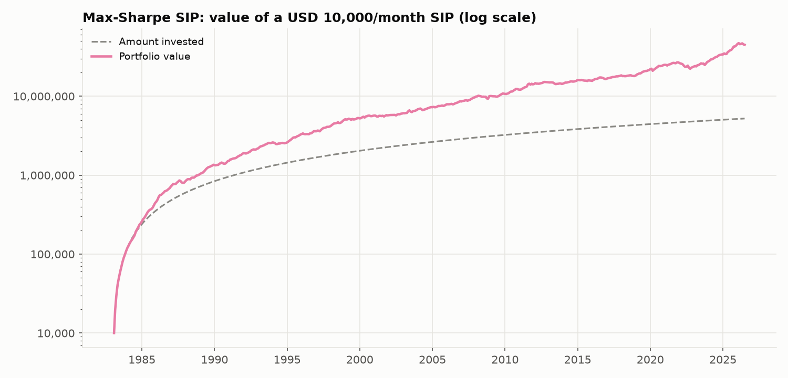
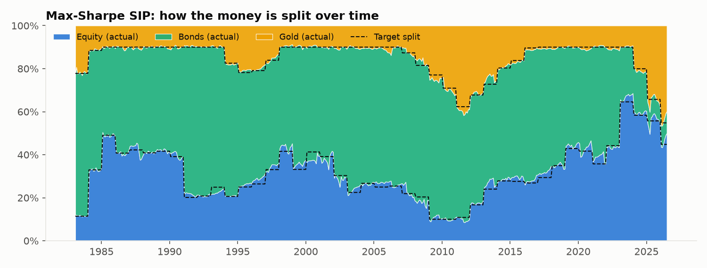
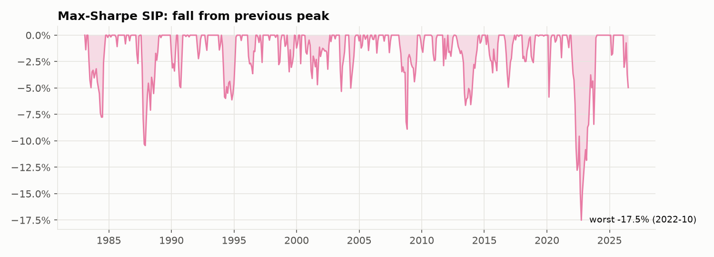

# Strategy 5: Max-Sharpe SIP

> **Idea:** Let a formula choose the split that gave the **most return per unit of risk** over the last 10 years (Markowitz mean-variance optimisation, the textbook "optimal portfolio").

## The rule

1. Every 12 months, look at **only the previous 120 months** of returns.
2. Estimate each asset's average return (μ) and the covariance matrix (Σ).
3. Choose weights that **maximise the Sharpe ratio**, keeping each asset between **10% and 70%**.
4. Each month, send the instalment to the assets **below their target** first (no selling).
5. Only rebalance (sell) if an asset drifts **more than 5 points** from its target.

## The formula

    maximise   Sharpe(w) = (w · μ) / √(wᵀ Σ w)
               = expected portfolio return / portfolio volatility
    subject to  w_Equity + w_Bonds + w_Gold = 1,   0.10 ≤ w_i ≤ 0.70

μ = average monthly returns and Σ = covariance matrix, both from the last 120 months.

## Worked example: your first month (Feb 1983)

Returns that month: Equity +2.13%, Bonds −0.69%, Gold +2.08% (see `00_raw_data/`).

On 1 Feb 1983 the optimizer looks at Feb 1973 – Jan 1983:

| | Equity | Bonds | Gold |
|---|---|---|---|
| Average return/yr (1973–83) | 7.6% | 7.0% | 24.2% |
| Volatility/yr | 14.1% | 9.0% | 29.5% |
| **Max-Sharpe weight** | **11.4%** | **66.4%** | **22.2%** |
| Money invested (of 10,000) | 1,142 | 6,636 | 2,222 |
| End of Feb 1983 (after cost and returns) | 1,165 | 6,584 | 2,266 |

It chases what did well in the past: gold had boomed in the 1970s and stocks had
struggled, so it bought little equity just before the great 1980s stock rally. This shows
the weakness of relying on past averages.

## How it behaves over time

The target jumps around more than risk parity's, because it reacts to recent returns. It rebalanced 36 times and sold the most of the optimizer strategies (about 8.8% of the portfolio a year).

## Results

**Setup (identical for all six strategies):** 10,000 invested on the 1st of every month
from **Feb 1983 to Jul 2026** (522 instalments, **5,220,000 invested**), 0.1% cost on
every trade, USD data (rupee version below).

| Measure | Value | What it means |
|---|---|---|
| Final value | **44,802,372** | What the 5,220,000 grew into (8.6×) |
| XIRR | **8.1%** | Yearly return earned on your SIP money |
| Volatility | 6.1% | How bumpy the ride was (yearly) |
| Sharpe ratio | **1.37** | Return per unit of bumpiness (higher = better) |
| Worst fall in account | **-17.2%** | Biggest drop from a peak you would have seen |
| Max drawdown (returns) | -17.5% | Same idea, ignoring new instalments |
| Selling per year | 8.8% | Share of the portfolio sold yearly (tax proxy) |

**Every possible 10-year SIP** (403 start dates, Feb 1983 onwards):

| Median XIRR | Worst XIRR | Best XIRR | % that lost money | Typical worst fall | Worst fall (any) |
|---|---|---|---|---|---|
| 6.7% | 3.2% | 13.4% | 0.0% | -3.7% | -11.9% |

**Through market crashes** (return of the portfolio during each period):

| Period | Return |
|---|---|
| 1987 crash (Sep-Nov 1987) | -10.3% |
| Dot-com bust (Sep 2000-Sep 2002) | 0.0% |
| Global financial crisis (Nov 2007-Feb 2009) | 5.3% |
| COVID crash (Feb-Mar 2020) | -4.5% |
| 2022 rate shock (Jan-Sep 2022) | -14.9% |

**Rupee investor (same assets, returns converted to INR):** final value
270,309,129, XIRR **14.0%**, Sharpe 1.67, worst fall
-11.8%, 0.0% of 10-year SIPs lost money.

### Charts







## Strengths and weaknesses

**Strengths**
- Higher return than risk parity (8.1% vs 7.7%) with a similar worst fall (−17%).
- Rose during the 2008–09 crash (+5.3%).

**Weaknesses**
- **Most sensitive to noisy return estimates**: it chases the recent past, and its median 10-year result (6.7%) is the lowest of the six.
- Sells the most of all six strategies (more tax events and costs).

## Files in this folder

| File | What it is |
|---|---|
| `strategy.py` | **The rule, in code.** Run it to regenerate everything below |
| `results/usd/summary.md` | All results in one page (also `summary.csv`) |
| `results/usd/monthly.csv` | Month-by-month: instalment, value of each asset, target and actual split, amount bought/sold, costs |
| `results/usd/rolling_10y_windows.csv` | XIRR and worst fall of each of the 403 ten-year SIPs |
| `results/usd/crises.csv` | Return in each crash period |
| `results/usd/*.png` | The three charts above |
| `results/inr/` | The same files for a rupee investor |

## How to run

```bash
python 05_max_sharpe_sip/strategy.py
```

It reads the prepared returns table from `00_raw_data/`, runs the SIP month by month
using the shared engine in `sip/` (the same for all six strategies) and rewrites
`results/`.
