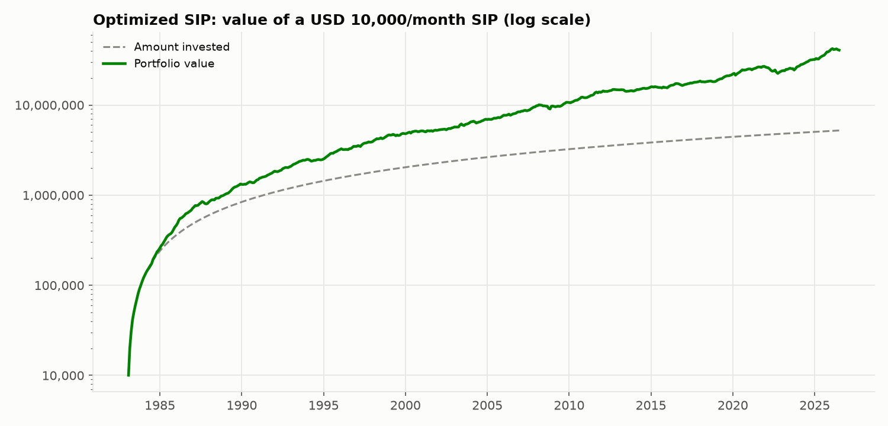
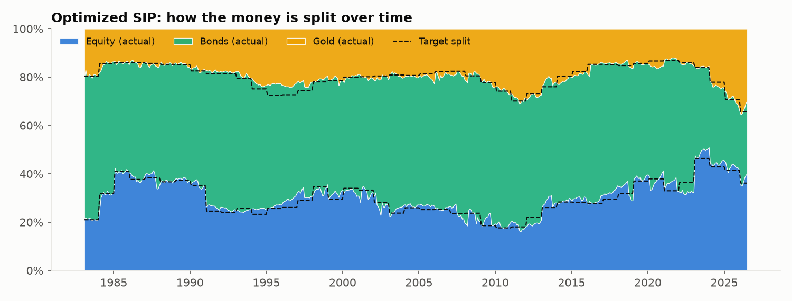
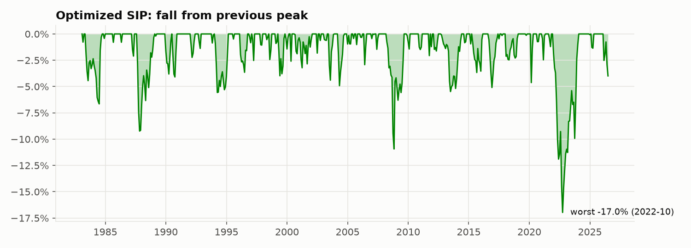

# Strategy 6: Optimized SIP (½ risk parity + ½ max Sharpe)

> **Idea:** Combine the two optimizers: the **careful** one (risk parity, strategy 4) and the **ambitious** one (max Sharpe, strategy 5). Averaging two different estimates usually reduces the error of each.

## The rule

1. Every 12 months, using **only the previous 120 months**, compute both the
   **risk-parity** weights and the **max-Sharpe** weights (each within 10–70%).
2. **Target = average of the two.**
3. Each month, send the instalment to the assets **below their target** first (no selling).
4. Only rebalance (sell) if an asset drifts **more than 5 points** from its target.

## The formula

    w_Optimized = ½ × w_RiskParity + ½ × w_MaxSharpe

Smart instalment (each month, for each asset i):

    V     = current portfolio value + new instalment
    gap_i = max(w_i × V − holding_i, 0)          (how far below target)
    → fill the gaps first, split any remainder by w

Band rebalance: if  max_i | holding_i / total − w_i | > 5%  →  reset every asset to w_i × total.

## Worked example: your first month (Feb 1983)

Returns that month: Equity +2.13%, Bonds −0.69%, Gold +2.08% (see `00_raw_data/`).

On 1 Feb 1983 (window Feb 1973 – Jan 1983):

| | Equity | Bonds | Gold |
|---|---|---|---|
| Risk parity (strategy 4) | 30.5% | 52.6% | 16.9% |
| Max Sharpe (strategy 5) | 11.4% | 66.4% | 22.2% |
| **Optimized target (average)** | **21.0%** | **59.5%** | **19.6%** |
| Money invested (of 10,000) | 2,095 | 5,949 | 1,956 |
| End of Feb 1983 (after cost and returns) | 2,138 | 5,902 | 1,994 |

**Month 2 (smart instalment):** the portfolio would be 20,034, so the targets are
4,197 / 11,919 / 3,918. Holdings were 2,138 / 5,902 / 1,994, so the gaps were
2,060 / 6,017 / 1,924, and the new 10,000 filled exactly those gaps.

**First rebalance (Feb 1985):** the new yearly target moved to 41 / 45 / 14, bonds were
6.7 points over target (more than 5), so 17,936 of bonds were sold and moved into
equity and gold.

## How it behaves over time

The allocation chart shows the actual split (areas) tracking the yearly target (dashed) closely, with only 23 rebalances in 522 months; the smart instalments do most of the work.

## Results

**Setup (identical for all six strategies):** 10,000 invested on the 1st of every month
from **Feb 1983 to Jul 2026** (522 instalments, **5,220,000 invested**), 0.1% cost on
every trade, USD data (rupee version below).

| Measure | Value | What it means |
|---|---|---|
| Final value | **40,653,139** | What the 5,220,000 grew into (7.8×) |
| XIRR | **7.8%** | Yearly return earned on your SIP money |
| Volatility | 5.7% | How bumpy the ride was (yearly) |
| Sharpe ratio | **1.42** | Return per unit of bumpiness (higher = better) |
| Worst fall in account | **-16.6%** | Biggest drop from a peak you would have seen |
| Max drawdown (returns) | -17.0% | Same idea, ignoring new instalments |
| Selling per year | 4.7% | Share of the portfolio sold yearly (tax proxy) |

**Every possible 10-year SIP** (403 start dates, Feb 1983 onwards):

| Median XIRR | Worst XIRR | Best XIRR | % that lost money | Typical worst fall | Worst fall (any) |
|---|---|---|---|---|---|
| 7.0% | 3.5% | 11.6% | 0.0% | -3.5% | -11.5% |

**Through market crashes** (return of the portfolio during each period):

| Period | Return |
|---|---|
| 1987 crash (Sep-Nov 1987) | -9.2% |
| Dot-com bust (Sep 2000-Sep 2002) | 2.1% |
| Global financial crisis (Nov 2007-Feb 2009) | 2.5% |
| COVID crash (Feb-Mar 2020) | -3.2% |
| 2022 rate shock (Jan-Sep 2022) | -14.4% |

**Rupee investor (same assets, returns converted to INR):** final value
255,750,794, XIRR **13.8%**, Sharpe 1.77, worst fall
-9.0%, 0.0% of 10-year SIPs lost money.

### Charts







## Strengths and weaknesses

**Strengths**
- Worst fall only 17%, and never lost money over any 10-year period.
- **Sharpe 1.42**, just behind risk parity (1.44) and ahead of every fixed mix.
- Slightly more return than risk parity (7.8% vs 7.7%) and less selling than max Sharpe.
- Rose during 2008–09 (+2.5%) and the dot-com crash (+2.1%).

**Weaknesses**
- Not the best on any single measure: risk parity alone is marginally safer, and the simple ⅓ split earns more (9.0%).
- Much lower return than 100% equity (7.8% vs 11.3%).
- Like all bond-heavy strategies, it suffered in 2022 (−14%).

## Files in this folder

| File | What it is |
|---|---|
| `strategy.py` | **The rule, in code.** Run it to regenerate everything below |
| `results/usd/summary.md` | All results in one page (also `summary.csv`) |
| `results/usd/monthly.csv` | Month-by-month: instalment, value of each asset, target and actual split, amount bought/sold, costs |
| `results/usd/rolling_10y_windows.csv` | XIRR and worst fall of each of the 403 ten-year SIPs |
| `results/usd/crises.csv` | Return in each crash period |
| `results/usd/*.png` | The three charts above |
| `results/inr/` | The same files for a rupee investor |

## How to run

```bash
python 06_optimized_sip/strategy.py
```

It reads the prepared returns table from `00_raw_data/`, runs the SIP month by month
using the shared engine in `sip/` (the same for all six strategies) and rewrites
`results/`.
