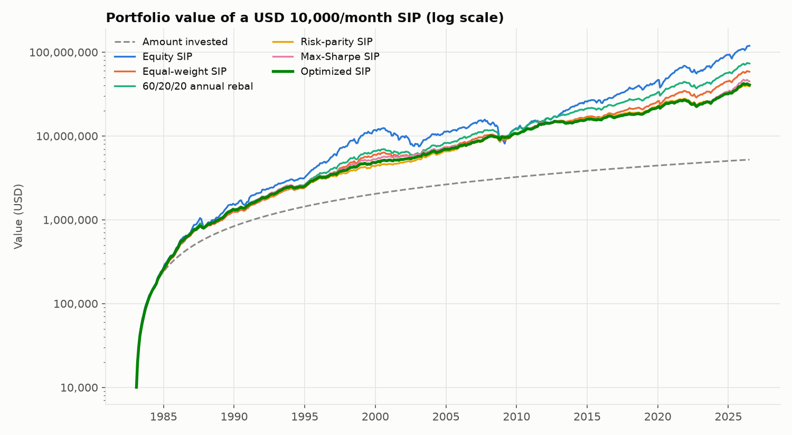
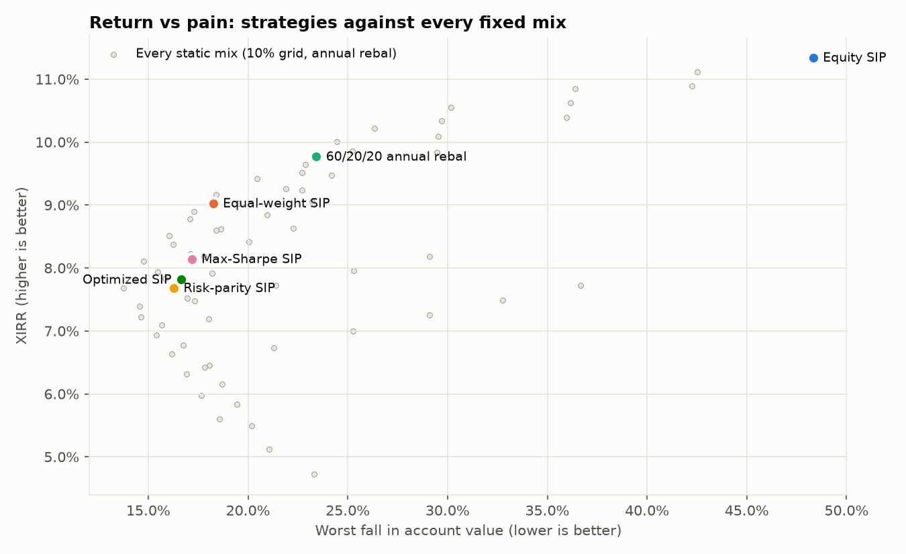
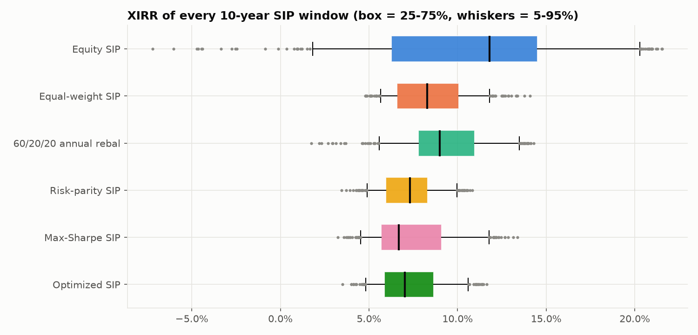

# 07 · Comparison: All Six Strategies Side by Side

> **What this folder does:** loads the six strategies from folders `01_` to `06_`, runs
> them on **identical** data, months, instalments and costs, and adds the tests that only
> make sense side by side. This is where the project's conclusion comes from.

**Setup:** 10,000 on the 1st of every month, Feb 1983 – Jul 2026 (522 instalments,
5,220,000 invested), 0.1% cost per trade, USD data (rupee results at the end).

## 1. Full-period results

| # | Strategy | Final value | XIRR | Volatility | Sharpe | Worst fall | Selling/yr |
|---|---|---|---|---|---|---|---|
| 1 | [Equity SIP](../01_equity_sip) | 119.1 M | **11.3%** 🥇 | 12.3% | 0.99 | −48.3% | 0% |
| 2 | [Equal-weight ⅓ each](../02_equal_weight_sip) | 58.5 M | 9.0% | 6.9% | 1.29 | −18.2% | 0% |
| 3 | [60/20/20](../03_fixed_60_20_20_sip) | 73.3 M | 9.8% | 7.6% | 1.29 | −23.4% | 3.8% |
| 4 | [Risk parity](../04_risk_parity_sip) | 39.1 M | 7.7% | **5.5%** 🥇 | **1.44** 🥇 | **−16.3%** 🥇 | 5.3% |
| 5 | [Max Sharpe](../05_max_sharpe_sip) | 44.8 M | 8.1% | 6.1% | 1.37 | −17.2% | 8.8% |
| 6 | [Optimized (½ + ½)](../06_optimized_sip) | 40.7 M | 7.8% | 5.7% | 1.42 | −16.6% | 4.7% |





The grey dots in the second chart are **all 66 fixed mixes** on a 10% grid (0/0/100,
10/0/90, …). The three optimizer strategies sit on the low-risk edge of that cloud.

## 2. Was it luck? Every 10-year SIP (403 start dates)

| Strategy | Median XIRR | Worst XIRR | % that lost money | Typical worst fall |
|---|---|---|---|---|
| Equity SIP | **11.8%** | −7.2% | **3.0%** | −18.5% |
| Equal-weight | 8.3% | **4.8%** | 0% | −5.0% |
| 60/20/20 | 9.0% | 1.7% | 0% | −8.6% |
| Risk parity | 7.3% | 3.5% | 0% | **−3.4%** |
| Max Sharpe | 6.7% | 3.2% | 0% | −3.7% |
| Optimized | 7.0% | 3.5% | 0% | −3.5% |



## 3. Optimize once vs re-learn every year (train/test split)

The best fixed mix on **1983–2004 only** (highest Sharpe of 66 mixes) was **30/60/10**.
Everyone was then tested on the **unseen** years **Nov 2004 – Jul 2026**:

| Strategy (unseen period) | XIRR | Sharpe |
|---|---|---|
| Equity SIP | 13.1% | 0.91 |
| 60/20/20 | 10.7% | 1.25 |
| Equal-weight | 9.8% | 1.30 |
| Max Sharpe | 8.5% | 1.24 |
| Optimized | 8.0% | 1.30 |
| Risk parity | 7.5% | 1.34 |
| **Best fixed mix from 1983–2004** | **6.4%** | 1.25 |

A mix that was "perfect" for the past did worst in the future. Strategies that
**re-learn every year** (4–6) adapted better.

## 4. Crashes (portfolio return during each period)

| Period | Equity | ⅓ each | 60/20/20 | Risk parity | Max Sharpe | Optimized |
|---|---|---|---|---|---|---|
| 1987 crash | −25.0% | −9.6% | −15.8% | −8.3% | −10.3% | −9.2% |
| Dot-com 2000–02 | −39.9% | −16.5% | −17.9% | +3.9% | 0.0% | +2.1% |
| 2008–09 crisis | −46.0% | −12.8% | −21.2% | +0.3% | +5.3% | +2.5% |
| COVID 2020 | −18.8% | −9.0% | −9.2% | −1.8% | −4.5% | −3.2% |
| 2022 rate shock | −16.7% | −14.7% | −14.2% | −14.1% | −14.9% | −14.4% |

In 2022, stocks and bonds fell together, so no strategy was protected.

## 5. Do the Optimized SIP's settings matter? (sensitivity)

Re-running the Optimized SIP with 5, 10 or 15-year look-backs and 3%, 5% or 10% bands
gave XIRR between **7.2% and 8.1%** every time. The result doesn't depend on lucky
settings. Full table: `results/usd/results.md`.

## 6. Rupee investor (same assets in INR)

| Strategy | XIRR | Sharpe | Worst fall |
|---|---|---|---|
| Equity SIP | **16.9%** | 1.36 | −38.4% |
| Equal-weight | 14.4% | 1.70 | −13.2% |
| 60/20/20 | 15.2% | 1.74 | −14.0% |
| Risk parity | 13.4% | **1.80** | **−8.2%** |
| Max Sharpe | 14.0% | 1.67 | −11.8% |
| Optimized | 13.8% | 1.77 | −9.0% |

Same ranking; all returns are higher because the rupee fell from 8 to 95 per dollar.

## 7. Conclusion

1. **100% equity makes the most money** (11.3% a year) but with the biggest falls
   (−48%) and a real chance of losing money over 10 years.
2. **Any diversified SIP removes that chance** and at least halves the worst fall.
3. **The optimizer-based SIPs (4, 5, 6) give the best return per unit of risk** (Sharpe
   1.37–1.44) and the smallest falls (about −16% to −17%), at the cost of lower return
   (7.7–8.1%). **Risk parity alone is marginally the best** on risk; the Optimized blend
   earns slightly more and trades less than max Sharpe.
4. **A simple ⅓ split is a very strong benchmark:** more return (9.0%) for a similar
   worst fall (−18%). This matches the finance research on naive diversification
   (DeMiguel, Garlappi & Uppal, 2009).
5. **Re-learning every year beats optimizing once** on past data (8.0% vs 6.4% on unseen
   years).

**In one line:** optimization doesn't make you the most money; it gives the best balance
between money and safety.

## Files and how to run

```bash
python 07_comparison/run.py                 # USD  -> results/usd/
python 07_comparison/run.py --currency INR  # INR  -> results/inr/
```

`results/<currency>/results.md` has every table (including sensitivity and the hindsight
best mix); the CSVs hold the raw numbers; the PNGs are the charts.
