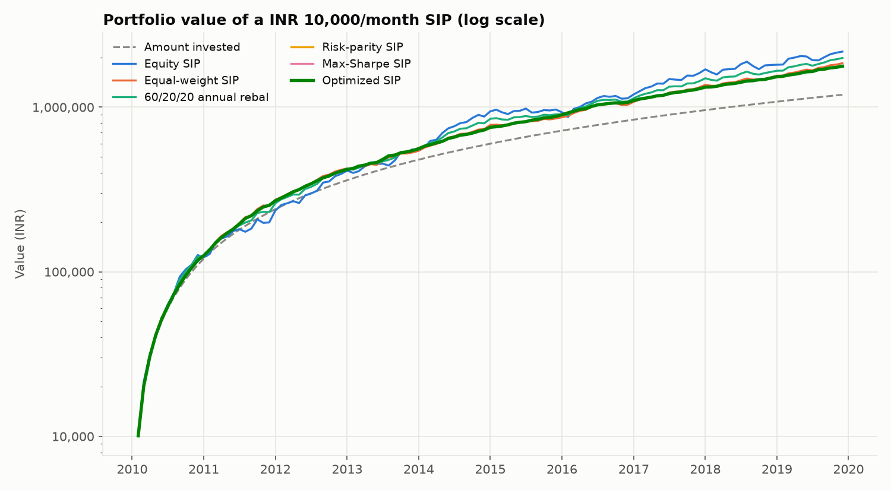
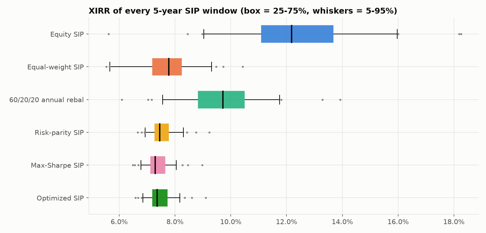
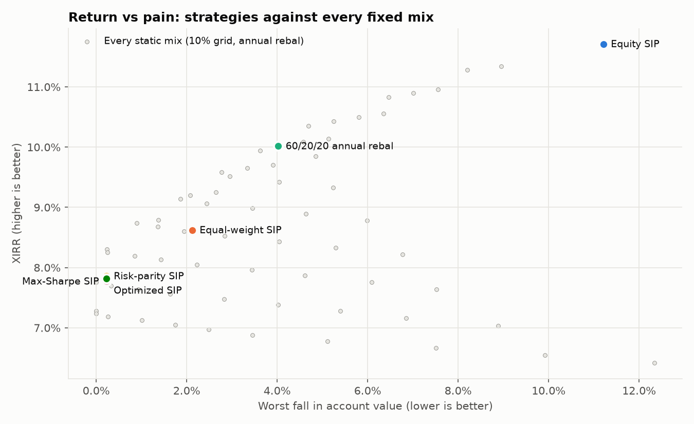

# 07 · Comparison: All Six Strategies Side by Side

> **What this folder does:** loads the six strategies from folders `01_` to `06_`, runs them
> on **identical** data, months, instalments and costs, and adds the tests that only make
> sense side by side. This is where the project's conclusion comes from.

**Setup:** ₹10,000 on the 1st of every month, **Feb 2010 – Dec 2019** (119 instalments,
₹1,190,000 invested), 0.1% cost per trade, Nifty 50 / Gold (₹) / Liquid returns from
`00_raw_data/`.

## 1. Full-period results

| # | Strategy | Final value | XIRR | Volatility | Sharpe (vs 0%) | **Sharpe vs Liquid** | Max drawdown | Worst account fall |
|---|---|---|---|---|---|---|---|---|
| 1 | [Equity (100% Nifty)](../01_equity_sip) | ₹2,176,119 | 11.7% | 15.3% | 0.76 | **0.29** | -23.7% | -11.2% |
| 2 | [Equal-weight ⅓ each](../02_equal_weight_sip) | ₹1,850,460 | 8.6% | 6.5% | 1.40 | **0.28** | -6.5% | -2.1% |
| 3 | [60/20/20](../03_fixed_60_20_20_sip) | ₹1,990,520 | 10.0% | 8.8% | 1.15 | **0.33** | -8.9% | -4.0% |
| 4 | [Risk parity](../04_risk_parity_sip) | ₹1,778,154 | 7.9% | 3.1% | 2.59 | **0.26** | -1.7% | -0.2% |
| 5 | [Max Sharpe](../05_max_sharpe_sip) | ₹1,770,116 | 7.8% | 3.2% | 2.49 | **0.24** | -1.8% | -0.2% |
| 6 | [Optimized (½ + ½)](../06_optimized_sip) | ₹1,774,231 | 7.8% | 3.2% | 2.54 | **0.25** | -1.7% | -0.2% |

Reference: a SIP kept **100% in Liquid** earned **7.3%**.



### Why two Sharpe ratios?

**Sharpe vs Liquid**

```
Sharpe_vs_Liquid = 12 × mean(TWR_t − r_Liquid,t) / σ
```

| Term | What it stands for |
|---|---|
| `TWR_t` | the strategy's monthly return |
| `r_Liquid,t` | Liquid's return that month (≈ 91-day T-bill) |
| `σ` | the strategy's yearly volatility |

**Example:** Optimized SIP: Sharpe vs 0% = 2.54 but Sharpe vs Liquid = 0.25. Most of its return is simply the T-bill rate earned by its 70% Liquid holding.

**Code:** [`sip/metrics.py` line 71](../sip/metrics.py#L71): `out["Sharpe vs Liquid"] = excess_vs_rf.mean() * MONTHS / ann_vol`

The usual Sharpe ratio subtracts a **risk-free rate**. The original design used 0%, which was
harmless with US bonds (7% volatility). Here **Liquid is almost risk-free** (0.5% volatility),
so measured against 0% anything holding a lot of Liquid looks brilliant (Sharpe ≈ 2.5). That's
also why the optimisers chose the maximum 70% Liquid. Measured against Liquid, the strategies
are close, and **60/20/20 annual rebal** is the best.

## 2. Every 5-year SIP (60 start dates, Feb 2010 onwards)

Only 5-year windows fit inside the 10-year SIP period (the US version used 10-year windows over 43 years).

**Rolling windows**

```
for every start month s:  run a fresh 5-year SIP from s,  record its XIRR and worst fall
```

| Term | What it stands for |
|---|---|
| `s` | each month from Feb 2010 to 2015-01 |

**Example:** The first window runs Feb 2010 – Jan 2015; the last 2015-01 – Dec 2019.

**Code:** [`sip/analysis.py` line 19](../sip/analysis.py#L19): `for i in range(0, len(idx) - n + 1, step):`

| Strategy | Median XIRR | Worst XIRR | Best XIRR | Typical worst fall |
|---|---|---|---|---|
| Equity SIP | 12.2% | 5.6% | 18.3% | -8.0% |
| Equal-weight SIP | 7.8% | 5.5% | 10.4% | -0.6% |
| 60/20/20 annual rebal | 9.7% | 6.1% | 13.9% | -2.0% |
| Risk-parity SIP | 7.5% | 6.7% | 9.2% | 0.0% |
| Max-Sharpe SIP | 7.3% | 6.5% | 9.0% | 0.0% |
| Optimized SIP | 7.4% | 6.6% | 9.1% | 0.0% |

No window lost money for any strategy: 2010–2019 was a steady decade for Indian SIPs.



## 3. Optimise once vs re-learn every year (train/test split)

**Train / test**

```
train: pick the fixed mix (10% grid, 66 mixes) with the highest Sharpe vs Liquid on the first half
test:  run every strategy, and that fixed mix, on the unseen second half
```

| Term | What it stands for |
|---|---|
| `first half` | Feb 2010 – Dec 2014 |
| `second half` | Jan 2015 – Dec 2019 |

**Example:** Best mix on 2010–2014: **{'Nifty': 0.6, 'Gold': 0.3, 'Liquid': 0.1}**.

**Code:** [`sip/analysis.py` line 84](../sip/analysis.py#L84): `w_star = best_static(grid, assets)`

| Strategy (Jan 2015 – Dec 2019) | XIRR | Sharpe vs Liquid | Worst account fall |
|---|---|---|---|
| Equity SIP | 11.5% | 0.24 | -7.8% |
| Equal-weight SIP | 9.5% | 0.24 | 0.0% |
| 60/20/20 annual rebal | 10.4% | 0.26 | -1.8% |
| Risk-parity SIP | 7.9% | 0.25 | 0.0% |
| Max-Sharpe SIP | 7.8% | 0.23 | 0.0% |
| Optimized SIP | 7.9% | 0.23 | 0.0% |
| Best static (train-tuned) | 10.8% | 0.27 | -1.7% |

Here the fixed mix tuned on 2010–2014 did **well** on 2015–2019. That's the opposite of the
US result, where "optimise once" did worst. With the optimisers stuck at 70% Liquid,
re-learning every year did not help on this data.

Best fixed mix with perfect hindsight over the whole period: **{'Nifty': 0.6, 'Gold': 0.3, 'Liquid': 0.1}**.



## 4. Indian market stress periods (strategy return over each period)

| Period | 100% Nifty | ⅓ each | 60/20/20 | Risk parity | Max Sharpe | Optimized |
|---|---|---|---|---|---|---|
| 2011 slowdown + euro crisis (Jan-Dec 2011) | -23.7% | 4.5% | -6.9% | 8.6% | 9.1% | 8.8% |
| 2013 taper tantrum, rupee crash (Jun-Aug 2013) | -8.3% | 3.4% | -1.7% | 3.9% | 4.2% | 4.0% |
| 2015-16 China/global sell-off (Mar 2015-Feb 2016) | -20.5% | -2.3% | -8.7% | 4.9% | 5.2% | 5.1% |
| 2018 IL&FS crisis (Sep-Oct 2018) | -10.9% | -2.4% | -5.2% | 0.3% | 0.4% | 0.4% |

The gold + Liquid heavy strategies rose in every stress period: gold in rupees jumped when the
rupee fell (2011, 2013), and Liquid never falls.

## 5. Do the Optimized SIP's settings matter? (sensitivity)

With look-backs of 60 months → 7.9%, 90 months → 7.8%, 120 months → 7.8% (5% band), the result barely changes. Band width and smart vs
pro-rata instalments also make almost no difference. Full table: `results/results.md`.

## 6. Conclusion (Nifty 50 / Gold / Liquid, 2010–2019)

1. **100% Nifty earned the most** (11.7% a year) with the biggest falls
   (-23.7% in 2011).
2. **60/20/20 had the best return above the T-bill rate per unit of risk** (Sharpe vs Liquid
   0.33) and the second-highest return
   (10.0%).
3. **The optimiser strategies (4–6) became ~70% cash.** Liquid barely moves, so both risk
   parity and max Sharpe (measured against 0%) push it to the 70% cap. They had tiny falls,
   but earned only about 0.5% a year more than a 100% Liquid SIP,
   and their Sharpe vs Liquid (0.25) is below 60/20/20.
4. **The mechanics are identical to the US study; the data changes the answer.** With US
   bonds (a risky asset) the optimisers gave the best risk-adjusted result. With a cash-like
   Liquid fund, measuring risk against 0% makes them simply hold cash.
5. **What would fix it (not applied, to keep the mechanics identical):** treat Liquid as the
   risk-free rate inside the optimiser (maximise Sharpe *vs Liquid*), or lower the cap on Liquid.

## Files and how to run

```bash
python 07_comparison/run.py
```

`results/results.md` has every table (including sensitivity and the hindsight best mix); the
CSVs hold the raw numbers; the PNGs are the charts.
