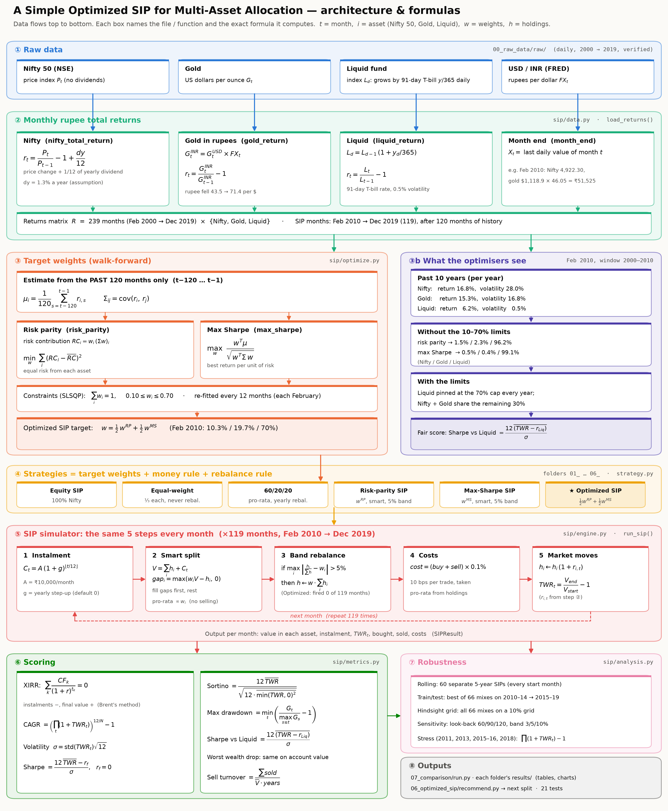

# A Simple Optimized SIP Strategy for Multi-Asset Allocation

Degree project (BTP). A **SIP** (Systematic Investment Plan) invests a fixed amount every
month. This project asks: **how should each month's ₹10,000 be split between Nifty 50, gold and
a liquid fund?** It tests six ways of splitting it on Indian market data (2000–2019; SIPs run
**Feb 2010 – Dec 2019**) and compares them fairly.

## How the repository is organised

Read the folders in order. Each strategy folder is self-contained: **explanation at the top
of its README (every formula with its terms, a Feb 2010 example and the line of code), the
rule in `strategy.py`, and its own `results/`.**

| Folder | What's inside |
|---|---|
| [`00_raw_data/`](00_raw_data) | Daily Nifty / Gold / Liquid data + USD/INR, how they become monthly rupee returns, and the data verification. **Every strategy uses this one table.** |
| [`01_equity_sip/`](01_equity_sip) | Strategy 1: **100% Nifty 50**, the usual SIP (benchmark) |
| [`02_equal_weight_sip/`](02_equal_weight_sip) | Strategy 2: **⅓ each** in Nifty, gold and liquid, never rebalanced |
| [`03_fixed_60_20_20_sip/`](03_fixed_60_20_20_sip) | Strategy 3: **60/20/20** Nifty/Gold/Liquid, reset once a year |
| [`04_risk_parity_sip/`](04_risk_parity_sip) | Strategy 4: **risk parity**, an optimiser that gives each asset equal risk |
| [`05_max_sharpe_sip/`](05_max_sharpe_sip) | Strategy 5: **max Sharpe**, an optimiser that maximises return per unit of risk |
| [`06_optimized_sip/`](06_optimized_sip) | Strategy 6: **Optimized SIP**, the average of 4 and 5 |
| [`07_comparison/`](07_comparison) | **All six side by side**, robustness tests and the conclusion |
| [`sip/`](sip) | Shared engine used by all six: monthly SIP simulator, optimisers, scoring |
| [`tests/`](tests) | Automated checks (formulas, no look-ahead, data integrity) |
| [`docs/`](docs) | Architecture diagram and the 20-step worked example |
| [`extras/`](extras) | Not part of the main study: the earlier **US-data version** (1973–2026) and the **AI forecasting** extension |

Strategies 4–6 are **optimised but not AI**: every year they recalculate the split from the
**previous 10 years only** (no look-ahead).

## Headline results (₹10,000/month, Feb 2010 – Dec 2019, ₹11.9 lakh invested)

| Strategy | Final value | Return/yr (XIRR) | Max drawdown | Sharpe vs Liquid |
|---|---|---|---|---|
| 1 · 100% Nifty | ₹2,176,119 | 11.7% | -23.7% | 0.29 |
| 2 · ⅓ each | ₹1,850,460 | 8.6% | -6.5% | 0.28 |
| 3 · 60/20/20 | ₹1,990,520 | 10.0% | -8.9% | 0.33 |
| 4 · Risk parity | ₹1,778,154 | 7.9% | -1.7% | 0.26 |
| 5 · Max Sharpe | ₹1,770,116 | 7.8% | -1.8% | 0.24 |
| 6 · Optimized | ₹1,774,231 | 7.8% | -1.7% | 0.25 |

A SIP kept 100% in Liquid earned 7.3%.

**Bottom line:** 100% Nifty earned the most but fell hardest. **60/20/20 gave the best
return above the T-bill rate per unit of risk.** The optimiser SIPs (4–6) turned into ~70%
cash: Liquid barely moves, so the optimisers, which measure risk against a 0% rate, push it
to the 70% cap. They had tiny falls but earned only a little more than cash. Details:
[`07_comparison/`](07_comparison).

## Run it

```bash
pip install -r requirements.txt
python run_all.py            # rebuilds data, all six strategies, the comparison and these READMEs
python -m pytest -q          # automated checks
```

`python 06_optimized_sip/recommend.py --amount 10000` prints the Optimized SIP's split for the
next instalment (from the latest data, Dec 2019).

## Architecture



## Further reading

- [`docs/WORKED_EXAMPLE.md`](docs/WORKED_EXAMPLE.md): one investor followed through all 20 steps with real numbers
- [`extras/us_data/`](extras/us_data): the same study on US data 1973–2026 (earlier version, with its own report)
