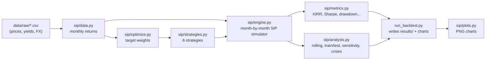

# The Project Explained From the Ground Up

This document walks through **everything** in the project, in the order the data flows.
Each part has three layers:

* 🧒 **Simple version**: what is going on, explained as if to a child.
* 📐 **Formula**: the exact maths the code uses.
* 📁 **Where**: the file and function that does it.

For the results and discussion, see `REPORT.md`. This document explains *how* they were
produced.

---

## Part 0: The idea in one picture

🧒 Imagine you get pocket money every month and have **three piggy banks**:

* 🐂 **Equity** (company shares): grows fastest, but sometimes crashes hard.
* 🛡️ **Bonds** (lending money to the government): grows slowly and steadily.
* 🪙 **Gold**: does its own thing, and often rises when everything else is scared.

Every month you must decide **how to split your pocket money** between the three. The
project asks: *is there a simple rule for splitting it that makes you richer, or at
least less scared, than putting everything into one bank?*

To answer that, we use a **time machine made of old data**. We pretend we started saving
in 1983, apply the rule month by month up to 2026, and see what would have happened.
That is called a **backtest**.

---

## Part 1: Architecture

### 1.1 The pipeline



Read it left to right:

1. **Raw data** (CSV files) →
2. are turned into **monthly returns** ("how much did each piggy bank grow this month?") →
3. the **optimizer** looks at past returns and decides the **target split** →
4. a **strategy** = a target split + rules for how to invest the money →
5. the **engine** simulates the SIP month by month →
6. **metrics** grade the result →
7. **analysis** repeats the experiment many ways to check it wasn't luck →
8. **run_backtest.py** runs everything and saves tables and charts.

### 1.2 The files and their jobs

| File | One-line job | Kitchen analogy |
|---|---|---|
| `data/raw/*.csv` | Raw historical data (bundled, so it works offline) | Groceries |
| `sip/data.py` | Clean the data and turn prices into monthly returns | Washing and chopping |
| `sip/optimize.py` | Maths that picks the best split of money | The recipe |
| `sip/strategies.py` | Define the 6 strategies we compare | The 6 dishes on the menu |
| `sip/engine.py` | Simulate investing month by month | The stove |
| `sip/metrics.py` | Score each strategy | The taste test |
| `sip/analysis.py` | Re-run in many conditions to test robustness | Cooking it 400 times to be sure |
| `sip/plots.py` | Draw the charts | Plating |
| `run_backtest.py` | Runs all of the above in order | The head chef |
| `tests/test_sip.py` | Automated checks that the maths is right | Food-safety inspection |

### 1.3 Design choices and why

* **Monthly data:** an SIP is monthly, so monthly steps match reality, and monthly data
  goes back 50+ years.
* **Bundled data:** anyone (your examiner too) can rerun it without internet and get the
  **same numbers**. This is called *reproducibility*.
* **Engine separate from strategy:** the engine doesn't care *how* weights were chosen.
  It just follows instructions, so any new strategy can plug in without changing the
  engine.
* **Weights precomputed as a table:** the optimizer runs once and fills a table saying
  "in month X, the target is Y". The engine just reads the table, which makes 400+
  repeat simulations fast (the whole study runs in about 11 seconds).

---

## Part 2: The data (`sip/data.py`)

### 2.1 What a "return" is

🧒 If your piggy bank had 100 at the start of the month and 102 at the end, it grew by
2%. That 2% is the **return**.

📐 For a price series *P*:

$$r_t = \frac{P_t}{P_{t-1}} - 1$$

Example: P goes from 100 to 102, so r = 102/100 − 1 = 0.02 = 2%.

Everything in the project works with returns, not prices, because returns let us
compare assets that cost very different amounts (gold at $4,000 vs an index at 7,000).

### 2.2 Equity: S&P 500 with dividends (`equity_total_return`)

🧒 Owning shares pays you in two ways: the price goes up, **and** companies send you a
small share of profits (a **dividend**). Ignoring dividends would undercount equity by
about 2–4% a year, so we add them back. That gives a **total return**.

📐 Shiller's file gives the price *P* and the dividend *D* as an **annual** amount, so
one month's dividend is *D/12*:

$$r_t^{\text{equity}} = \frac{P_t + D_{t-1}/12}{P_{t-1}} - 1$$

**Data fix:** the file shows D = 0 for the most recent months (not yet published). We
take the last known **dividend yield** (D/P) and carry it forward (`ffill`), so recent
months don't lose their dividend.

### 2.3 Bonds: a synthetic 10-year government bond fund (`bond_total_return`)

🧒 A bond is an IOU: you lend 100, and the government pays you interest (the
**coupon**) every year and returns 100 at the end. The tricky part: **if interest rates
rise, your old bond becomes less valuable**, because new bonds pay more. That's why
bonds can lose money, as they did in 2022.

We only have the **yield** (interest rate) history, not a bond fund's price, so we
**build** the fund ourselves:

1. At the start of each month, buy a new 10-year bond at "par" (price 1.00), paying a
   coupon equal to last month's yield *y(t−1)*.
2. One month later, the bond has 9 years and 11 months left. Look at today's yield
   *y(t)* and ask what the bond is worth now.
3. Return = change in price + one month of interest.

📐 Price of a bond paying coupon *c* twice a year, at yield *y*, with *T* years left
(the standard present-value formula, with *n = 2T* half-year periods):

$$\text{Price} = \frac{c/2}{y/2}\left(1 - (1+y/2)^{-n}\right) + (1+y/2)^{-n}$$

* First term: today's value of all the coupon payments.
* Second term: today's value of getting your 1.00 back at the end.

Then:

$$r_t^{\text{bond}} = \text{Price}\big(c = y_{t-1},\ y = y_t,\ T = 10 - \tfrac{1}{12}\big) - 1 + \frac{y_{t-1}}{12}$$

**Worked example:** buy at a 5% yield. Next month the yield rises to 5.5%. The code gives
Price = 0.9622, a **3.8% loss**, plus 5%/12 = 0.42% interest, so the month's return is
about **−3.4%**. If the yield stays at 5%, Price = 1.00 and the return is just the 0.42%
interest. (The unit test `test_par_bond_prices_at_par` checks this.)

### 2.4 Gold (`gold_return`)

🧒 Gold pays no interest or dividends, so its return is just the price change.

📐 $r_t^{\text{gold}} = P_t / P_{t-1} - 1$

### 2.5 Optional: rupee investor (`load_returns(currency="INR")`)

🧒 If you're in India buying US assets, you earn the asset's return **and** you gain
when the dollar gets stronger against the rupee (the rupee went from 8 to 95 per dollar
between 1973 and 2026).

📐 With FX = rupees per dollar:

$$r_t^{\text{INR}} = (1 + r_t^{\text{USD}}) \cdot \frac{FX_t}{FX_{t-1}} - 1$$

Example: the asset gains 1% and the dollar rises 0.5% against the rupee:
1.01 × 1.005 − 1 = 1.505%.

### 2.6 The final data table

`load_returns()` joins the three series on the same months and drops any month with a
gap. The result is **642 rows (Feb 1973 → Jul 2026) × 3 columns**. The first rows:

| Month | Equity | Bonds | Gold |
|---|---|---|---|
| 1983-02 | +2.13% | −0.69% | +2.08% |
| 1983-03 | +3.87% | +2.17% | −14.46% |
| 1983-04 | +4.20% | +1.55% | +3.10% |

`load_yahoo()` is an optional extra loader for Indian ETFs, if you have internet access.

---

## Part 3: The optimizer (`sip/optimize.py`)

This is the "brain" that decides **what fraction of money goes into each piggy bank**.
These fractions are called **weights**, written *w*, and they always add up to 1 (100%).

### 3.1 Two building blocks: average return and risk

From a window of past monthly returns we calculate:

* 📐 **Mean return** of each asset: $\mu_i = \frac{1}{N}\sum_t r_{i,t}$
* 📐 **Covariance matrix** Σ, a 3×3 table showing how much each asset wobbles and
  whether they wobble **together**:
  $\Sigma_{ij} = \text{average of } (r_i - \mu_i)(r_j - \mu_j)$.
  The diagonal holds each asset's variance (volatility squared).

🧒 If equity and gold usually move in *opposite* directions, holding both is calmer than
holding either alone, because the wobbles partly cancel. The covariance matrix captures
this.

For a portfolio with weights *w*:

* Expected return: $\mu_p = w^\top \mu = \sum_i w_i \mu_i$
* Variance (risk²): $\sigma_p^2 = w^\top \Sigma w$

### 3.2 Optimizer A: Risk parity (`risk_parity`)

🧒 "Make every piggy bank responsible for the **same amount of scariness**." Gold is very
jumpy, so it gets a **small** share. Bonds are calm, so they get a **big** share. Nobody
dominates the risk.

📐 The **risk contribution** of asset *i* is $RC_i = w_i (\Sigma w)_i$. The contributions
add up to the total portfolio variance. We choose *w* so that all *RC_i* are equal, by
minimizing:

$$\sum_i \left(RC_i - \overline{RC}\right)^2$$

(The code multiplies by 10⁸ only to help the solver with very small numbers.)

**Why use it:** it needs **no forecast of returns**, only risk. Return forecasts are the
least reliable input in finance, so risk parity is robust.

### 3.3 Optimizer B: Maximum Sharpe (`max_sharpe`)

🧒 "Get the **most growth per unit of scariness**."

📐 Maximize the **Sharpe ratio**:

$$\max_w \ \frac{w^\top \mu - r_f}{\sqrt{w^\top \Sigma w}}$$

This does use past returns (μ), so it chases what did well recently. That is good when
trends continue and bad when they reverse. It is the "return-seeking but noisy" half.

(`min_variance` also exists in the code, minimizing $w^\top\Sigma w$. It is used only in a
unit test and isn't part of the final strategies.)

### 3.4 The constraints (rules every optimizer must obey)

* $\sum_i w_i = 1$: spend all the money.
* $0.10 \le w_i \le 0.70$: each asset gets at least 10% and at most 70%.

🧒 Without these limits, the maths often says "put 100% in one thing", which is fragile.
The limits force real diversification.

### 3.5 How the solver works (`_solve`)

The code uses **SLSQP** (Sequential Least Squares Programming) from `scipy`. It is a
standard algorithm for "minimize this function subject to these rules". It starts at
1/3 each and moves step by step downhill until it can't improve. Afterwards the result
is clipped to the bounds and rescaled to sum to exactly 1, as a safety step.

### 3.6 Walk-forward: the "no cheating" rule (`walk_forward_weights`)

🧒 In an exam you can't peek at the answers. In a backtest, **"peeking" means using
future data to make past decisions**. If in 1990 we used data up to 2026 to pick the
split, the results would look amazing but be fake. This is called **look-ahead bias**,
and it is the most common mistake in student backtests.

**Our rule:** to decide the split for month *t*, use **only the 120 months before t**
(the last 10 years).

* The first decision needs 10 years of history, so the SIP starts in **Feb 1983**
  (data starts Feb 1973).
* The weights are re-calculated **every 12 months**. That means every February, since
  that's when the first fit happened. Between re-fits the target stays the same.

```
1973──────────1983 → fit on 1973-83, use for Feb 1983 – Jan 1984
 1974──────────1984 → fit on 1974-84, use for Feb 1984 – Jan 1985
  1975──────────1985 → ...
```

This is also called a **rolling window** or **walk-forward optimization**.

✅ The unit test `test_walk_forward_has_no_look_ahead` proves it: it deliberately
corrupts all data after month 200, reruns, and checks that the weights before month 200
are **identical**.

### 3.7 The proposed "Optimized SIP" weights

📐 Target = average of the two optimizers:

$$w^{\text{Optimized}} = \tfrac{1}{2}\, w^{\text{RiskParity}} + \tfrac{1}{2}\, w^{\text{MaxSharpe}}$$

**Real example, Feb 1983** (fitted on Feb 1973 – Jan 1983):

| | Equity | Bonds | Gold |
|---|---|---|---|
| Risk parity | 30.5% | 52.6% | 16.9% |
| Max Sharpe | 11.4% | 66.4% | 22.2% |
| **Optimized (average)** | **21.0%** | **59.5%** | **19.6%** |

🧒 Why average? It's like asking two friends for advice: one careful (risk parity) and
one ambitious (max Sharpe). Their average is usually more sensible than either alone.
In statistics this is a simple form of **shrinkage**: blending estimates reduces errors.

### 3.8 The grid (`weight_grid`)

This lists **every** split on a 10% grid: (0, 0, 100), (0, 10, 90), …, (100, 0, 0). There
are **66 combinations**. It is used in Part 7 to test all fixed mixes.

---

## Part 4: The six strategies (`sip/strategies.py`)

A **strategy** = a **target weights table** + **how the monthly money is invested** +
**when to rebalance**.

| # | Name | Target | Money rule | Rebalance | Role |
|---|---|---|---|---|---|
| 1 | Equity SIP | 100/0/0 | – | – | What most people do, the main benchmark |
| 2 | Equal-weight SIP | 33/33/33 | pro-rata | never | The "no brain" benchmark |
| 3 | 60/20/20 annual rebal | 60/20/20 | pro-rata | every 12 months | Classic fixed mix (a 60/40 variant) |
| 4 | Risk-parity SIP | walk-forward RP | smart | 5% band | Optimizer A alone |
| 5 | Max-Sharpe SIP | walk-forward MS | smart | 5% band | Optimizer B alone |
| 6 | **Optimized SIP** | average of 4 and 5 | smart | 5% band | **The proposal** |

Strategies 4 and 5 exist so we can see whether **combining** them (6) helps. This kind of
comparison is called an **ablation**.

---

## Part 5: The engine, i.e. the SIP simulator (`sip/engine.py`)

This is the heart of the backtest: a loop that plays out every month.

### 5.1 The monthly instalment (`contribution_schedule`)

📐 $C_t = A \cdot (1 + g)^{\lfloor t/12 \rfloor}$

* *A* = monthly amount (default 10,000).
* *g* = yearly step-up (default 0; `--step-up 0.10` means +10% every year).
* ⌊t/12⌋ = number of full years passed.

### 5.2 The five steps of every month

We track *h*, the money held in each asset (a list of 3 numbers).

**Step 1: the instalment arrives.** 10,000 must be invested.

**Step 2: split the instalment.** There are two ways:

* **Pro-rata:** split by the target. With a 60/20/20 target: 6,000 / 2,000 / 2,000.
* **Smart (`_smart_split`):** 🧒 "Feed the hungriest piggy bank first." If gold is below
  its target share, the new money goes to gold first. The portfolio moves back toward
  target **without selling anything**.

📐 Smart split algorithm:

1. New total after investing: $V = \sum_i h_i + C$
2. How much each asset is **short** of its target: $\text{gap}_i = \max(w_i V - h_i,\ 0)$
3. Total shortfall: $\text{need} = \sum_i \text{gap}_i$
4. Then:
   * If need = 0 (already on target), split pro-rata: $w_i C$.
   * If need ≥ C (not enough money to fix everything), share C in proportion to the
     gaps: $\frac{\text{gap}_i}{\text{need}} C$.
   * Otherwise, fill every gap, then split the leftover pro-rata:
     $\text{gap}_i + w_i(C - \text{need})$.

Example: holdings (80, 20, 0), target (50%, 50%, 0%), instalment 20. The new total is
120, so the targets are 60 and 60. The gaps are 0 and 40, so need = 40 > 20, and all 20
goes to asset 2. (Checked by `test_smart_split_fills_underweight_first`.)

**Step 3: maybe rebalance (sell and buy back to target).**

* `calendar`: every 12 months, no matter what.
* `band`: only when some asset is more than 5 percentage points away from its target.
  📐 Rebalance if $\max_i \left|\frac{h_i}{\sum h} - w_i\right| > 0.05$
* When it fires: new holdings = $w_i \cdot \sum h$. Anything reduced counts as **sold**.

🧒 If equity had a great year and grew from 60% to 70% of the portfolio, you're now
taking more risk than planned. Rebalancing sells some equity and buys the others to get
back to 60%. Over 43 years, the Optimized SIP needed this in only **23 of 522 months**,
because the smart instalments do most of the work.

**Step 4: pay transaction costs.**

📐 $\text{cost} = (\text{bought} + \text{sold}) \times \frac{10}{10{,}000}$ (10 basis points = 0.1%)

The cost is taken from all holdings proportionally.

**Step 5: the market moves.**

📐 $h_i \leftarrow h_i \times (1 + r_{i,t})$

We also record this month's **time-weighted return** (TWR):

$$\text{TWR}_t = \frac{\sum h \text{ after the market move}}{\sum h \text{ after investing, before costs}} - 1$$

This measures how well the **portfolio** did this month, ignoring the fact that new money
was added. It's needed for fair risk measures (Part 6).

### 5.3 Worked example: the first month of the Optimized SIP (Feb 1983)

Target 20.95% / 59.49% / 19.56%. Holdings start at 0, so the smart split = pro-rata.

| | Equity | Bonds | Gold | Total |
|---|---|---|---|---|
| Invest 10,000 | 2,095.0 | 5,949.2 | 1,955.7 | 10,000 |
| Cost 0.1% (10 total) | 2,092.9 | 5,943.3 | 1,953.8 | 9,990 |
| × (1 + return) | × 1.0213 | × 0.9931 | × 1.0208 | |
| **End of month** | **2,138** | **5,902** | **1,994** | **10,034** |

These are exactly the numbers the code produces. Repeat 522 times and that's the
backtest.

### 5.4 What the engine outputs (`SIPResult`)

For every month: value in each asset, instalment paid, TWR, amount bought, amount sold,
and costs paid. Everything in Part 6 is calculated from these.

---

## Part 6: Scoring, i.e. the metrics (`sip/metrics.py`)

### 6.1 XIRR: "what yearly interest rate did my SIP earn?" (`xirr`, `sip_xirr`)

🧒 You put in 10,000 every month and ended with X. What constant bank interest rate
would have turned the same deposits into the same X? That rate is the **XIRR**. It's
what Indian mutual-fund statements show for SIPs.

📐 Find *r* such that the **net present value** of all cash flows is zero:

$$\sum_{k} \frac{CF_k}{(1+r)^{t_k}} = 0$$

* Instalments are **negative** (money leaving your pocket) at times *t* = 0, 1/12,
  2/12, … years.
* The final portfolio value is **positive** (money you get back) at *t* = N/12.

There's no formula to solve this directly, so the code uses **Brent's method**
(`scipy.optimize.brentq`). It keeps narrowing the range between −99% and +1000% until it
finds *r* to 10 decimal places.

✅ `test_xirr_matches_known_rate`: put in 100, get 110 a year later, XIRR = 10%.
✅ `test_sip_xirr_equals_constant_monthly_return`: if every month returns exactly 1%, the
XIRR equals 1.01¹² − 1 = 12.68%.

**Why not CAGR?** CAGR works for a single lump sum. An SIP has 522 deposits made at
different times, and only XIRR handles that correctly.

### 6.2 TWR CAGR: how good the portfolio itself was

📐 $\text{CAGR} = \left(\prod_t (1 + \text{TWR}_t)\right)^{12/N} - 1$

This chains all the monthly returns together and converts the result to a yearly rate.
Unlike XIRR, it ignores **when** you deposited money. It measures the recipe, not your
luck with timing.

### 6.3 Volatility: "how bumpy is the ride?"

📐 $\sigma = \text{std}(\text{TWR}_t) \times \sqrt{12}$

The standard deviation of monthly returns, converted to yearly. We multiply by √12
because variance grows with time, so the standard deviation grows with √time.

### 6.4 Sharpe ratio: "growth per unit of bumpiness"

📐 $\text{Sharpe} = \frac{\overline{\text{TWR}} \times 12 - r_f}{\sigma}$, with $r_f = 0$ here.

Higher is better. A Sharpe of 1.42 means 1.42% of yearly return for every 1% of
volatility. ⚠️ Using $r_f = 0$ flatters low-risk portfolios. This is a stated limitation.

### 6.5 Sortino ratio: "only count the bad bumps"

📐 $\text{Sortino} = \frac{\overline{\text{TWR}} \times 12}{\sqrt{\text{mean}(\min(\text{TWR}_t, 0)^2)} \times \sqrt{12}}$

Like Sharpe, but it only penalizes **downward** moves. Nobody complains about upside
surprises.

### 6.6 Max drawdown: "the worst fall from a peak"

🧒 Your tower of blocks was 100 tall at its highest and later fell to 51. That's a 49%
drawdown.

📐 With growth index $G_t = \prod_{s \le t}(1+\text{TWR}_s)$:

$$\text{MDD} = \min_t \left(\frac{G_t}{\max_{s \le t} G_s} - 1\right)$$

✅ Test: the series 1, 2, 1, 3 has a max drawdown of −50%.

### 6.7 Worst wealth drop: "the worst fall you'd actually see in your account"

The same formula, applied to the **actual account value** (which includes new
instalments) instead of the growth index. This is the number that makes real people
panic and stop their SIP.

### 6.8 Calmar ratio

📐 $\text{Calmar} = \text{CAGR} / |\text{MDD}|$: return per unit of worst-case pain.

### 6.9 Annual sell turnover and cost drag

📐 $\text{Sell turnover} = \frac{\sum \text{sold}}{\text{average portfolio value}} \div \text{years}$

The share of the portfolio sold each year. Every sale can mean **capital-gains tax**
(and exit loads in India), so lower is better. Cost drag uses the same formula with the
costs paid.

---

## Part 7: Proving it wasn't luck (`sip/analysis.py`)

One backtest is **one path through history**. Maybe the result depends on the start
date. So we test in five more ways.

### 7.1 Rolling 10-year windows (`rolling_windows`, `rolling_summary`)

🧒 Instead of one person starting in 1983, imagine **403 different people**, each
starting a 10-year SIP one month after the previous person (Feb 1983, Mar 1983, … up to
the last possible start). What happened to all of them?

For each strategy we report: the median XIRR, the 5th percentile (a bad-luck case), the
worst and best, the % of people who lost money, the % who beat pure equity, and the
typical and worst drawdown. Chart: `rolling_xirr.png` (a box plot).

### 7.2 Train/test split (`train_test_split`)

🧒 Study on old exam papers (**train**, 1983–2004), then sit the real exam (**test**,
2004–2026).

1. Try all 66 fixed mixes on the training half and pick the one with the best Sharpe.
   Result: **30/60/10**.
2. Run every strategy, plus that "best" mix frozen, on the test half.

This shows what happens to the common approach of optimizing once and keeping the
answer forever, compared with our walk-forward approach, which keeps re-learning.
Result: the frozen mix earned **6.4%** a year and the Optimized SIP **8.0%**.

### 7.3 Hindsight grid (`static_grid`, `best_static`)

All 66 fixed mixes over the **full** period. This is the "cheating" answer (it needs to
know the future) and is used only as a reference. It forms the grey dots in
`frontier.png`. A good real-time strategy should sit **near the top-left edge** of that
cloud: high return, low pain.

### 7.4 Sensitivity and ablation (`sensitivity`)

🧒 "Does the recipe still work with a little more or less salt?" We rerun the Optimized
SIP with:

* look-backs of **60, 120 and 180** months,
* bands of **3%, 5% and 10%**,
* **pro-rata + annual rebalance** instead of smart instalments,
* **smart instalments with no rebalancing at all**.

All variants run over the same months (from Feb 1988, when the 180-month version first
has enough data), so the comparison is fair. Finding: results barely change (XIRR
7.2–8.1% across all 15 variants), so the strategy isn't fragile. Smart instalments alone reach similar returns
with **zero selling**.

### 7.5 Stress periods (`crisis_table`)

📐 For each crisis window, the cumulative return is $\prod (1 + \text{TWR}_t) - 1$.

The windows are the 1987 crash, the dot-com bust, the 2008 financial crisis, COVID and
the 2022 rate shock.

---

## Part 8: The runner and outputs (`run_backtest.py`, `sip/plots.py`)

`python run_backtest.py [--currency INR] [--amount …] [--step-up …] [--cost-bps …] [--lookback …] [--window-years …]`

In order, it:

1. Loads returns and builds the 6 strategies.
2. Finds the first month where the optimizer has 10 years of history (Feb 1983).
3. Runs the full-period backtest → `summary.csv`.
4. Runs the rolling windows → `rolling_windows.csv`, `rolling_summary.csv`.
5. Runs the hindsight grid → `static_grid.csv`.
6. Runs the train/test split → `train_test.csv`.
7. Runs the sensitivity test → `sensitivity.csv`.
8. Computes crises and yearly returns → `crisis.csv`, `calendar_year_returns.csv`.
9. Draws the charts:

| Chart | What it shows |
|---|---|
| `wealth.png` | Account value over time for every strategy (log scale) plus total money invested |
| `drawdown.png` | How far each strategy was below its previous peak, month by month |
| `weights.png` | How the Optimized SIP's target split changed each year |
| `rolling_xirr.png` | Spread of outcomes across the 403 ten-year SIPs |
| `frontier.png` | Return vs worst fall: strategies against all 66 fixed mixes |

10. Writes everything into `results.md`.

**Why a log scale on `wealth.png`?** On a log scale, equal vertical distances mean equal
**percentage** growth. Without it, the last few years would dwarf everything else.

---

## Part 9: The tests (`tests/test_sip.py`)

18 automated checks, run with `python -m pytest -q` (the 3 forecasting tests are
explained in `FORECASTING.md`):

| Test | What it proves |
|---|---|
| `test_xirr_matches_known_rate` | XIRR maths is right (100 → 110 = 10%) |
| `test_sip_xirr_equals_constant_monthly_return` | The engine plus XIRR work together correctly |
| `test_costs_reduce_value` | Costs are charged exactly as intended |
| `test_smart_split_fills_underweight_first` | The smart instalment rule works |
| `test_calendar_rebalance_restores_target` | Rebalancing happens in month 12, not before |
| `test_step_up_schedule` | Step-up SIP amounts are right |
| `test_par_bond_prices_at_par` | The bond formula prices correctly (and moves the right way when yields change) |
| `test_max_drawdown` | Drawdown maths is right |
| `test_optimisers_respect_bounds` (×3) | Every optimizer stays within 10–70% and sums to 1 |
| `test_risk_parity_equalises_risk` | Risk parity really does equalize risk |
| `test_walk_forward_has_no_look_ahead` | **No cheating with future data** |
| `test_weight_grid_sums_to_one` | The grid has 66 valid mixes |
| `test_bundled_data_is_sane` | Data loads correctly and long-run returns are realistic |

---

## Part 10: The whole thing in 10 sentences

1. We take 50+ years of real monthly data for US stocks, government bonds and gold.
2. We turn prices into monthly **total returns** (including dividends and bond interest).
3. Every 12 months, an optimizer looks at **only the past 10 years** and picks a split:
   half from **risk parity** (equal risk) and half from **max Sharpe** (best return per risk).
4. Each asset is limited to between 10% and 70%, so the portfolio stays diversified.
5. Every month, 10,000 is invested, going first to whichever asset is **below target**.
6. We only sell to rebalance when an asset drifts more than 5 points off target.
7. Every trade pays a 0.1% cost.
8. We score the result with **XIRR** (what you earned), **Sharpe** (return per risk) and
   **drawdown** (the worst fall).
9. We repeat the test 403 times with different start dates, on a train/test split, with
   different settings, and through five crises.
10. Result: less return than 100% equity (7.8% vs 11.3%), but a much smaller worst fall
    (−17% vs −48%), the best risk-adjusted score, never a losing 10-year SIP, and better
    than "optimize once" out of sample. A simple 1/3 split remains a tough benchmark.

---

## Part 11: The machine-learning extension

A separate study (`sip/forecast.py`, `run_forecast.py`) tries to **predict next year's
return** of each asset with Ridge regression, random forest and gradient boosting, then
feeds the predictions into the optimizer. It's explained from the ground up, in the same
style as this document, in **`FORECASTING.md`**. `recommend.py` turns the strategy into
a monthly "what should I buy" tool.
